# 使用时间序列数据

用神经网络对图像进行分类是深度学习中最具标志性的工作之一。但这肯定不是神经网络擅长的唯一工作。另一个正在进行大量研究的领域是循环神经网络。

在这一章中，我们将深入探讨循环神经网络，以及它们如何应用于处理时间序列数据的场景中；例如，在需要预测温度或其他重要值的物联网解决方案中。

本章包括以下主题:

*   什么是循环神经网络？
*   循环神经网络的使用场景
*   循环神经网络是如何工作的
*   用 CNTK 构建循环神经网络


# 技术要求

我们假设您的计算机上安装了 Anaconda 的最新版本，并按照[第 1 章](9a2c8c46-f9a0-4e05-86ef-31300a28a7ba.xhtml)、*CNTK*入门中的步骤在您的计算机上安装 CNTK。本章的示例代码可以在我们的 GitHub 资源库中找到，网址是[https://GitHub . com/packt publishing/Deep-Learning-with-Microsoft-Cognitive-Toolkit-Quick-Start-Guide/tree/master/ch6](https://github.com/PacktPublishing/Deep-Learning-with-Microsoft-Cognitive-Toolkit-Quick-Start-Guide/tree/master/ch6)。

在本章中，我们将学习存储在 Jupyter 笔记本中的一个示例。要访问示例代码，请在下载代码的目录中的 Anaconda 提示符下运行以下命令:

```
cd ch6
jupyter notebook
```

样本代码存储在`Training recurrent neural networks.ipynb`笔记本中。请注意，如果您没有可以被 CNTK 使用的带有 GPU 的机器，那么运行本章的示例代码将需要很长时间。

看看下面的视频，看看代码是如何运行的:
[http://bit.ly/2TAdtyr](http://bit.ly/2TAdtyr)


# 什么是循环神经网络？

循环神经网络是一种特殊的神经网络，能够随着时间的推移进行推理。它们主要用于必须处理随时间变化的值的场景。

在常规的神经网络中，您只能提供一个输入，从而产生一个预测。这限制了常规神经网络的功能。例如，常规神经网络不擅长翻译文本，而循环神经网络在翻译任务中已经有相当多的成功实验。

在循环神经网络中，有可能提供导致单个预测的样本序列。还可以使用循环神经网络根据单个输入样本来预测输出序列。最后，您可以根据输入序列预测输出序列。

与其他类型的神经网络一样，您可以在分类作业和回归任务中使用循环神经网络，尽管根据网络的输出来识别使用循环网络执行的作业类型可能会更加困难。


# 循环神经网络变异

循环神经网络可以以多种方式使用。在这一节中，我们将看看循环神经网络的不同变体，以及它们如何用于解决特定类型的问题。具体来说，我们将了解以下变化:

*   基于输入序列预测单个输出
*   基于单个输入值预测序列
*   基于其他序列预测序列

最后，我们还将探索将多个循环神经网络堆叠在一起，以及这如何有助于在处理文本等场景中获得更好的性能。

让我们来看看可以使用循环网络的场景，因为有几种方法可以使用循环神经网络的独特属性。


# 基于序列预测单个输出

循环神经网络包含到输入的回送连接。当我们输入一个值序列时，它会按时间步长处理序列中的每个元素。由于环回连接，它可以将处理序列中的一个元素时生成的输出与序列中下一个元素的输入相结合。通过将先前时间步骤的输出与下一时间步骤的输入相结合，它将在整个序列上建立记忆，该记忆可用于进行预测。示意性地，基本的循环神经网络看起来像这样:

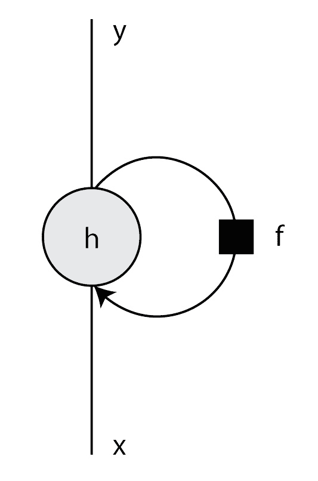

当我们将循环神经网络展开为各个步骤时，这种递归行为变得更加清晰，如下图所示:

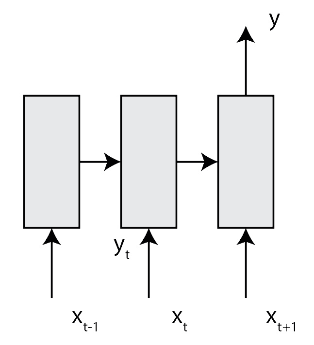

为了用这个循环神经网络进行预测，我们将执行以下步骤:

1.  首先，我们输入输入序列的第一个元素来创建一个初始隐藏状态。
2.  然后，我们获取初始隐藏状态，并将其与输入序列中的第二个元素相结合，以产生更新的隐藏状态。
3.  最后，我们取输入序列中的第三个元素来产生最终的隐藏状态，并预测循环神经网络的输出。

由于这种环回连接，您可以教循环神经网络识别随时间发生的模式。例如，当您想要预测明天的温度时，您将需要查看过去几天的天气，以发现可用于确定明天温度的模式。


# 基于单个样本预测序列

循环神经网络的基本模型也可以扩展到其他用例。例如，您可以使用相同的网络体系结构来预测基于单个输入的值序列，如下图所示:

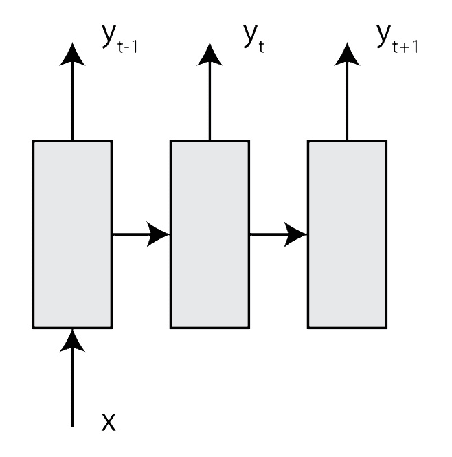

在这个场景中，我们有三个时间步长，每个时间步长将根据我们提供的输入预测输出序列中的一个步长。

1.  首先，我们将输入样本输入到神经网络中，以产生初始隐藏状态并预测输出序列中的第一个元素
2.  然后，我们将初始隐藏状态与相同的样本相结合，以产生更新的隐藏状态，并输出输出序列中的第二个元素
3.  最后，我们再次输入样本，再次更新隐藏状态，并预测输出序列中的最后一个元素

从一个样本生成一个序列与我们之前的样本有很大的不同，在我们之前的样本中，我们收集了输入序列中所有时间步长的信息来获得一个预测。在这个场景中，我们在每个时间步生成输出。

循环神经网络还有一个变化，它利用我们刚刚讨论的设置概念和我们在上一节中讨论的设置，根据一系列值预测一系列值。


# 基于序列预测序列

现在，我们已经了解了如何基于序列预测单个值和基于单个值预测序列，让我们来看看如何针对序列预测序列。在此方案中，您将执行与上一个方案相同的步骤，在上一个方案中，我们根据单个样本预测序列，如下图所示:


在这个场景中，我们有三个时间步骤，从输入序列中获取元素，并预测输出序列中我们想要预测的相应元素。让我们一步一步地回顾这个场景:

1.  首先，我们获取输入序列中的第一个元素，创建一个初始隐藏状态，并预测输出序列中的第一个元素。
2.  接下来，我们从输入序列中获取初始隐藏状态和第二个元素，以更新隐藏状态并预测输出序列中的第二个元素。
3.  最后，我们利用更新后的隐藏状态和输入序列中的最后一个元素来预测输出序列中的最后一个元素。

因此，我们不再像上一节那样为每一步重复相同的输入样本，而是一次输入一个元素，并将每一步生成的预测作为模型的输出序列。


# 堆叠多个循环层

循环神经网络可以有多个递归层。这使得循环网络的记忆容量更大，使得模型能够学习更复杂的关系。

例如，当您想要翻译文本时，您需要将至少两个递归层堆叠在一起，一个将输入文本编码为中间形式，另一个将它解码为您想要将文本翻译成的语言。谷歌有一篇有趣的论文，展示了如何使用这种技术将一种语言翻译成另一种语言，这篇论文在[https://arxiv.org/abs/1409.3215](https://arxiv.org/abs/1409.3215)可用。

因为您可以在许多方面使用循环神经网络，所以它在使用时间序列数据进行预测方面非常通用。在下一节中，我们将深入探讨循环网络内部如何工作的更多细节，以便更好地理解隐藏状态是如何工作的。


# 循环神经网络是如何工作的？

为了理解循环神经网络是如何工作的，我们需要仔细看看这些网络中的递归层是如何工作的。在循环神经网络中可以使用几种不同类型的递归层。在我们深入到递归单元的更高级版本之前，让我们首先讨论如何用标准递归层预测输出，以及如何训练包含递归层的神经网络。


# 用循环神经网络进行预测

基本循环层与神经网络中的常规层非常不同。通常，重复出现的层具有隐藏状态，作为层的记忆。从图层的输出到图层的输入有一个环回连接，如下图所示:

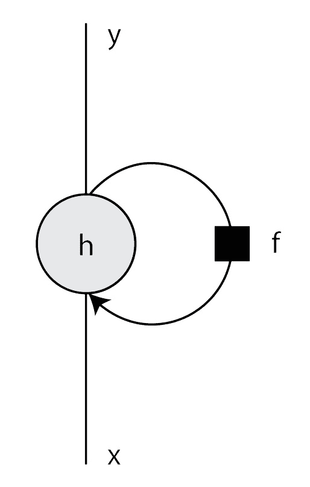

现在我们已经看到了一个基本的循环层是什么样子，让我们使用一系列的三个元素来一步一步地了解这个层类型是如何工作的。序列中的每一步称为一个时间步。要用递归层预测输出，我们需要用初始隐藏状态初始化该层。这通常使用全零来完成。隐藏状态的大小与输入序列中单个时间步长中的特征数量相同。

接下来，我们将需要更新序列中第一个时间步的隐藏状态。要更新第一个时间步长的隐藏状态，我们将使用以下公式:

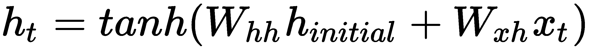

在这个公式中，我们通过计算初始隐藏状态(用零初始化)和一组权重之间的点积(即，元素乘积)来计算新的隐藏状态。我们将添加另一组权重和图层输入之间的点积。两个点积之和的结果通过一个激活函数传递，就像在常规的神经网络层中一样。这为我们提供了当前时间步长的隐藏状态。

当前时间步长的隐藏状态用作序列中下一个时间步长的初始隐藏状态。我们将重复在第一时间步中执行的计算，以更新第二时间步的隐藏状态。第二个时间步长的公式如下所示:

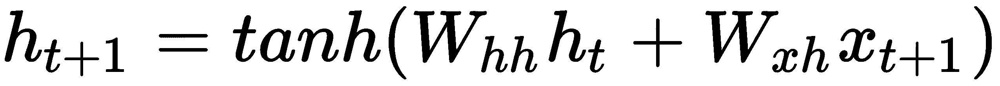

我们将计算隐藏状态的权重与步骤 1 中的隐藏状态之间的点积，并将输入与输入权重之间的点积相加。请注意，我们正在重用上一时间步的权重。

我们将为序列中的第三个也是最后一个步骤重复更新隐藏状态的过程，如以下公式所示:


当我们处理完序列中的所有步骤后，我们可以使用第三组权重和最后一个时间步骤的隐藏状态来计算输出，如以下公式所示:

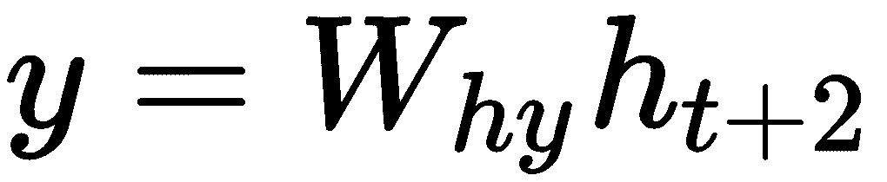

当您使用循环网络来预测输出序列时，您将需要在每个时间步长执行最终计算，而不仅仅是序列中的最终时间步长。


# 训练循环神经网络

与常规神经网络层一样，您可以使用反向传播来训练递归层。这一次，我们将对常规反向传播算法应用一个技巧。

在常规的神经网络中，您可以基于`loss`函数、输入和模型的预期输出来计算梯度。但这对循环神经网络不起作用。无法使用单个样本、目标值和`loss`函数来计算递归图层的损失。因为预测输出基于网络输入的所有时间步长，所以您还需要使用输入序列的所有时间步长来计算损耗。所以，你得到的不是一组梯度，而是一个梯度序列，当求和时会导致最终损失。

随着时间的推移反向传播比常规反向传播更难。为了达到`loss`函数的全局最优，我们需要更加努力地沿着梯度下降。我们的梯度下降算法向下走的山坡比常规神经网络高得多。除了更高的损耗之外，它还需要更长的时间，因为我们需要处理序列中的每个时间步长来计算和优化单个输入序列的损耗。

更糟糕的是，在反向传播过程中，我们有更大的机会看到爆炸梯度，因为在多个时间步长上增加了梯度。您可以通过使用有界激活来解决分解渐变的问题，例如**双曲正切函数** ( **tanh** )或`sigmoid`。这些激活函数将`tanh`函数的递归层输出值限制在-1 和 1 之间，将`sigmoid`函数的输出值限制在 0 和 1 之间。`ReLU`激活函数在循环神经网络中用处不大，因为梯度不受限制，这肯定会导致梯度在某个点爆炸。

限制激活函数产生的值会导致另一个问题。还记得在[第 2 章](4c9da7a9-6873-4de9-99a9-43de693d65f8.xhtml)、*用 CNTK* 构建神经网络中，`sigmoid`有一条特定的曲线，曲线两端的梯度迅速降低到零。我们在本节示例中使用的`tanh`函数具有相同类型的曲线，如下图所示:


介于-2 和+2 之间的输入值具有合理定义的梯度。这意味着我们可以有效地使用梯度下降来优化神经网络中的权重。然而，当循环层的输出低于-2 或高于+2 时，梯度变得更浅。这可能会变得非常低，以至于 CPU 或 GPU 开始将梯度四舍五入为零。这意味着我们不再学习。

由于涉及多个时间步骤，递归层比常规神经网络层更容易出现消失梯度或饱和问题。使用常规递归层时，您对此无能为力。但是，其他具有更高级设置的递归图层类型可以在一定程度上解决此问题。


# 使用其他重现图层类型

由于消失梯度问题，基本递归层不太擅长学习长期相关性。换句话说，它不能很好地处理长序列。当你试图处理句子或更长的文本序列，并试图对它们的意思进行分类时，你就会遇到这个问题。在英语和其他语言中，一个句子中赋予句子意义的两个相关单词之间有相当长的距离。当你只在你的模型中使用一个基本的递归层时，你会很快发现你的模型不太擅长对文本序列进行分类。

但是，还有其他更适合处理较长序列的递归图层类型。此外，他们倾向于更好地结合长期和短期相关性。


# 使用门控循环单元

基本循环层的一个替代方案是**门控循环单元** ( **GRU** )。该图层类型有两个门，有助于处理序列中的长距离相关性，如下图所示:

GRU 的形状比常规的循环层复杂得多。有更多的线路将不同的输入连接到输出。让我们看一下这个图表，看看这个层类型背后的一般思想是什么。

与常规的循环层不同，GRU 层有一个**更新门**和**重置门**。“重置”和“更新”门是控制保留多少先前时间步长的内存以及使用多少新数据来产生新内存的阀门。

预测输出与使用常规递归图层进行预测非常相似。当我们向层中输入数据时，以前的隐藏状态用于计算新隐藏状态的值。当序列中的所有元素都被处理后，使用一组额外的权重来计算输出，就像我们在常规递归层中所做的那样。

在 GRU 中计算多个时间步长的隐藏状态要复杂得多。更新 GRU 的隐藏状态需要几个步骤。首先，我们需要计算更新门的值，如下所示:


使用两组权重控制更新门，一组用于前一时间步的隐藏状态，另一组用于提供给层的当前输入。由更新门产生的值控制过去时间步长中有多少保持在隐藏状态。

第二步是更新复位门。这是使用以下公式完成的:

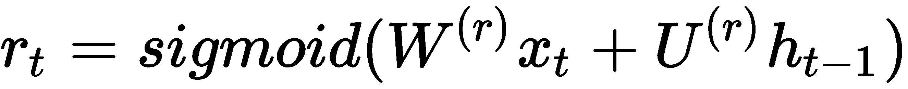

重置门也使用两组权重来控制；一组用于当前时间步长的输入值，另一组用于隐藏状态的权重。重置门控制隐藏状态被移除的程度。当我们如下计算新隐藏状态的初始版本时，这变得很清楚:


首先，我们将输入与其相应的权重相乘。然后，我们将先前的隐藏状态与其对应的权重相乘。然后，我们计算复位门和加权隐藏状态之间的逐元素乘积或哈达玛乘积。最后，我们将其添加到加权输入中，并在其上使用一个`tanh`激活来计算记忆的隐藏状态。

该公式中的重置门控制着对先前隐藏状态的遗忘程度。具有低值的重置门将从先前的时间步长中移除大量数据。较高的值将有助于图层记住上一时间步的大量内容。

但是我们还没有完成——一旦我们将来自前一个时间戳的信息通过更新门增加并通过重置门调节，这就产生了来自前一个时间步骤的记忆信息。现在，我们可以根据记住的信息计算最终的隐藏状态值，如下所示:

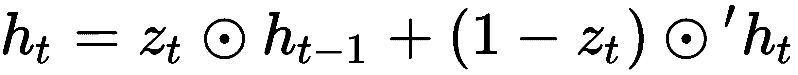

首先，我们采用前一个隐藏状态和更新门之间的元素乘积来确定前一个状态中应该保留多少信息。然后，我们将更新门和来自先前状态的记忆信息之间的逐元素乘积添加到该值中。请注意，更新门用于输入一定比例的新信息和一定比例的旧信息。这就是为什么我们在公式的第二部分使用了一个 *1-* 操作。

就所涉及的计算及其记忆长期和短期关系的能力而言，GRU 比循环层高了一大步。然而，它不能同时做到这两者。


# 处理长短期记忆单元

使用基本循环层的另一种替代方法是使用一个**长短期记忆** ( **LSTM** )单元。除了 LSTM 有更多的门之外，这个递归图层与我们在上一节中讨论的 GRU 一样使用门。

下图概述了 LSTM 图层的结构:

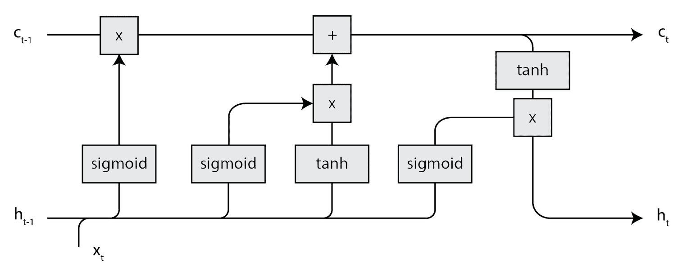

LSTM 单元的像元状态对此图层类型的工作方式至关重要。细胞状态保持很长一段时间，不会有太大变化。LSTM 层也有一个隐藏状态，但该状态在层中扮演不同的角色。

简而言之，LSTM 的长期记忆被建模为细胞状态，而短期记忆被建模为隐藏状态。使用几个门来保护对长期存储器的访问。LSTM 层中有两个控制长期内存访问的门:

*   遗忘门，控制从单元状态中遗忘的内容
*   输入门，它控制隐藏状态中存储的内容和单元状态中的输入内容

在 LSTM 层有一个最后的门，它控制着什么从细胞状态进入新的隐藏状态。本质上，我们使用输出门来控制从长期记忆中提取什么到短期记忆中。让我们一步一步来看这个层是如何工作的。

首先，我们来看看遗忘之门。使用 LSTM 图层进行预测时,“忽略门”是第一个更新的门:

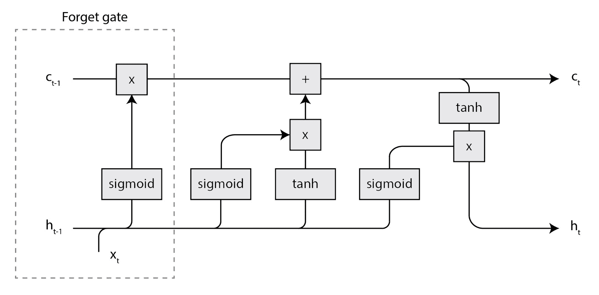

遗忘门控制应该遗忘多少单元状态。它使用以下公式进行更新:

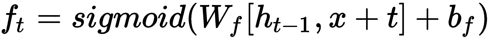

当你仔细观察这个公式时，你会注意到它本质上是一个带有`sigmoid`激活函数的密集层。遗忘门生成一个值在 0 和 1 之间的向量，以控制单元状态中有多少元素被遗忘。遗忘门上的值 1 意味着单元状态中的值被保持。遗忘门上的零值使单元状态遗忘其值。

我们将前一步中的隐藏状态和新输入连接成一个沿列轴的矩阵。单元状态本质上将存储关于提供给具有存储在层中的隐藏状态的层的输入的长期信息。

LSTM 层中的第二个门是输入门。输入门控制单元状态中存储多少新数据。新数据是上一步的隐藏状态和当前时间步的输入的组合，如下图所示:

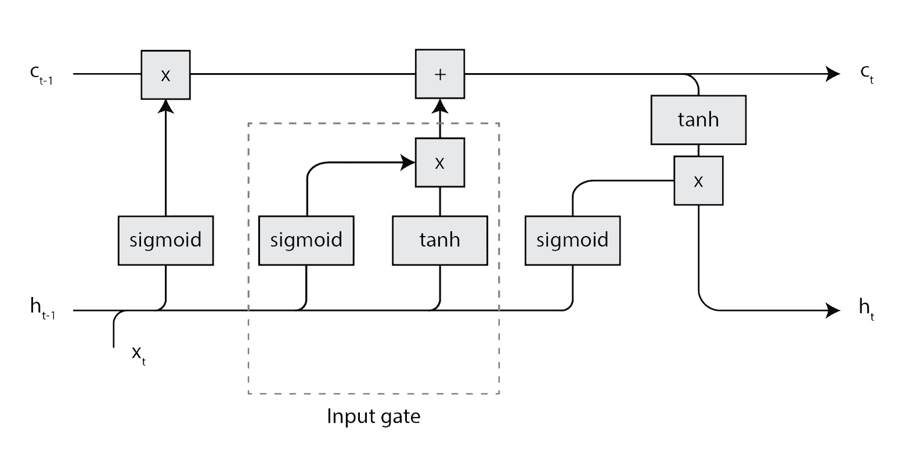

我们将使用以下公式来确定更新门的值:

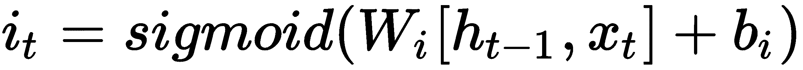

就像遗忘门一样，输入门被建模为 LSTM 层中的嵌套密集层。您可以看到输入门是上图中突出显示部分的左分支。输入门在以下公式中用于确定要放入单元状态的新值:

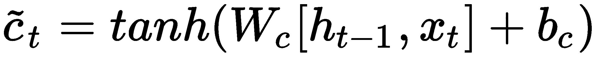

要更新单元状态，我们还需要一个步骤，下图突出显示了这个步骤:

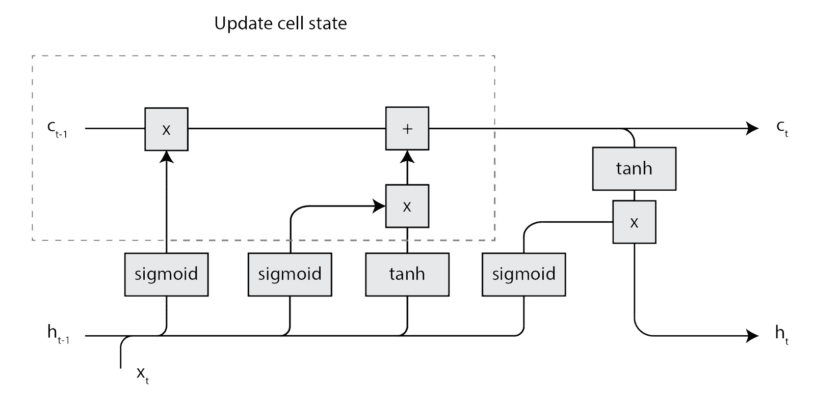

一旦我们知道了遗忘门和输入门的值，我们就可以使用以下公式计算更新后的单元状态:


首先，我们将忘记门乘以前一个单元状态以忘记旧信息。然后，我们将更新门与单元状态的新值相乘，以学习新信息。我们将两个值相加，得出当前时间步长的最终单元状态。

LSTM 层的最后一个门是输出门。此门控制在下一个时间步长的层和隐藏状态的输出中使用多少来自单元状态的信息，如下图所示:

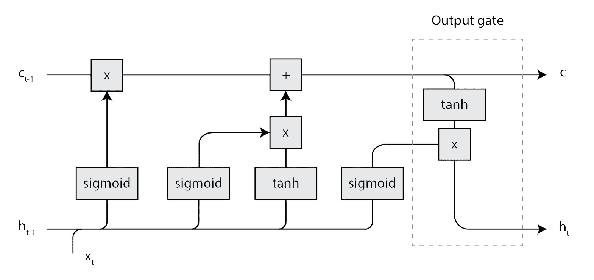

输出门通过以下公式计算:

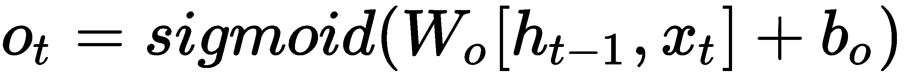

输出门就像输入门和遗忘门一样，是一个致密层，控制着有多少单元状态被复制到输出端。现在，我们可以使用以下公式计算层的新隐藏状态或输出:


您可以使用这个新的隐藏状态来计算下一个时间步长，或者将其作为图层的输出返回。


# 何时使用其他周期性图层类型

GRU 和 LSTM 层肯定比常规的循环层更复杂。他们有更多的参数需要训练。当您遇到问题时，这将使调试模型变得更加困难。

当您处理更长的数据序列时，常规的递归图层不太适用，因为它很快就会饱和。你可以用 LSTM 和 GRU 来解决这个问题。GRU 层在没有附加存储器状态的情况下工作。LSTM 使用细胞状态来模拟长期记忆。

因为 GRU 的门更少，而且没有记忆，所以训练它需要的时间更少。所以，如果你想处理更长的序列，并且需要一个可以相对快速训练的网络，使用 GRU 层。

LSTM 层有更大的能力来表达你给它的序列中的关系。这意味着，如果你有足够的数据来训练它，它会表现得更好。最后，最终要通过实验来确定哪种层类型最适合您的解决方案。


# 用 CNTK 构建循环神经网络

既然我们已经探索了循环神经网络背后的理论，是时候用 CNTK 来构建一个了。CNTK 为构建循环神经网络提供了几个构件。我们将探索如何使用包含太阳能电池板功率测量值的样本数据集来构建循环神经网络。

太阳能电池板的功率输出在一天中是变化的，所以很难预测一个典型的房子能产生多少功率。这使得当地能源公司很难预测他们应该生产多少额外的电力来满足需求。

幸运的是，许多能源公司提供软件，允许客户跟踪他们的太阳能电池板的功率输出。这将允许他们根据这些历史数据训练一个模型，因此我们可以预测每天的总功率输出。

我们将基于微软作为 CNTK 文档的一部分提供的数据集，使用循环神经网络来训练功率输出预测模型。

该数据集包含每天的多次测量，并包含某个时间戳的当前功率输出，以及截至该时间戳的总发电量。我们的目标是根据一天中收集的测量数据，预测一天的总发电量。

您可以使用常规的神经网络，但这意味着我们必须将每个收集到的测量值转化为输入的特征。这样做是假设测量值之间没有相关性。但是，实际上是有的。每个未来的测量都依赖于之前的测量。因此，对于这种情况，可以随时间推移进行推理的递归模型更加实用。

在接下来的三节中，我们将探讨如何在 CNTK 中构建一个循环神经网络。之后，我们将探索如何使用来自太阳能电池板数据集的数据来训练循环神经网络。最后，我们将看看如何用循环神经网络预测输出。


# 构建神经网络结构

在我们开始预测太阳能电池板的输出之前，我们需要构建一个循环神经网络。循环神经网络的构建方式与常规神经网络相同。下面是如何建立一个:

```
features = sequence.input_variable(1)

with default_options(initial_state = 0.1):
    model = Sequential([
        Fold(LSTM(15)),
        Dense(1)
    ])(features)

target = input_variable(1, dynamic_axes=model.dynamic_axes)
```

遵循给定的步骤:

1.  首先，创建一个新的输入变量来存储输入序列。
2.  然后，初始化神经网络的 default_options，并为 initial_state 设置提供值 0.1。
3.  接下来，为神经网络创建一个顺序层集。
4.  在顺序层集合中，提供一个 LSTM 循环层，其中 15 个神经元被包裹在一个折叠层中。
5.  最后，添加一个神经元的密集层。

有两种方法可以在 CNTK 中对循环神经网络建模。如果您只对递归层的最终输出感兴趣，您可以将`Fold`层与递归层结合使用，例如 GRU、LSTM 甚至 RNNStep。`Fold`层收集递归层的最终隐藏状态，并将其作为输出返回给下一层使用。

作为`Fold`层的替代，你也可以使用`Recurrence`块。这个包装器返回由包装在其中的递归层生成的完整序列。如果您希望使用循环神经网络生成顺序输出，这将非常有用。

循环神经网络处理顺序输入，这就是为什么我们使用`sequence.input_variable`函数而不是常规的`input_variable`函数。

常规的`input_variable`功能只支持输入的固定尺寸。这意味着我们必须知道每个样本需要输入到网络中的特征数量。这适用于常规模型和处理图像的模型。在图像分类模型中，我们通常使用一个维度作为颜色通道，另外两个维度作为输入图像的宽度和高度。我们预先知道所有这些方面。常规`input_variable`函数中唯一动态的维度是批处理维度。当您使用特定的迷你批次大小设置来训练模型时，会计算此维度，从而为批次维度生成一个固定值。

在循环神经网络中，我们不知道每个序列会有多长。我们只知道作为时间步长存储在序列中的每条数据的形状。`sequence.input_variable`函数允许我们提供每个时间步长的尺寸，并保持模拟序列长度的尺寸是动态的。与常规的`input_variable`功能一样，批次尺寸也是动态的。当我们以特定的迷你批次大小设置开始训练时，我们配置这个维度。

CNTK 处理顺序数据的方式是独一无二的。在 TensorFlow 这样的框架中，在开始训练之前，您必须预先指定序列长度和批量的维度。因为您必须使用固定大小的序列，所以您需要向比您的模型所支持的最大序列长度短的序列添加填充。此外，如果您有较长的序列，您需要截断它们。这会导致模型质量下降，因为您要求模型从序列中的空时间步长中学习信息。CNTK 可以很好地处理动态序列，所以在 CNTK 中处理序列时，不必使用填充。


# 堆叠多个循环层

在上一节中，我们只讨论了使用单个递归层。但是，您可以在 CNTK 中堆叠多个重复层。例如，当我们想要堆叠两个循环层时，我们需要使用以下层的组合:

```
from cntk import sequence, default_options, input_variable
from cntk.layers import Recurrence, LSTM, Dropout, Dense, Sequential, Fold, Recurrence

features = sequence.input_variable(1)

with default_options(initial_state = 0.1):
    model = Sequential([
        Recurrence(LSTM(15)),
        Fold(LSTM(15)),
        Dense(1)
    ])(features)
```

遵循给定的步骤:

1.  首先从`cntk`包中导入`sequence`模块、`default_options`函数和`input_variable`函数
2.  接下来，导入循环神经网络的层
3.  然后，创建一个新的有 15 个神经元的`LSTM`层，并将其包裹在一个`Recurrence`层中，这样该层返回一个序列而不是一个输出
4.  现在，创建第二个有 15 个神经元的`LSTM`层，但是这次将它包装在一个`Fold`层中，只返回最后的时间步长作为输出
5.  最后，使用特征变量调用创建的`Sequential`层堆栈来完成神经网络

这种技术也可以扩展到两层之外；只需在`Recurrence`图层中包裹最后一个循环图层之前的图层，并在`Fold`图层中包裹最后一个图层。

对于本章中的示例，我们将限制自己使用一个递归层，就像我们在上一节*构建神经网络结构*中构建的一样。在下一节中，我们将讨论如何训练我们创建的循环神经网络。


# 用时间序列数据训练神经网络

现在我们有了一个模型，让我们来看看如何在 CNTK 中训练一个循环神经网络。

首先，我们需要定义我们想要优化的损失函数。由于我们预测的是连续变量—功率输出—我们需要使用均方误差损失。我们将损失与均方差指标相结合来衡量我们模型的性能。请记住，在[第 4 章](e39df191-73e4-414f-b44b-efca6f0ad4cd.xhtml)、*验证模型性能*中，我们可以使用`@Function`将损失和指标合并到一个函数对象中:

```
@Function
def criterion_factory(z, t):
    loss = squared_error(z, t)
    metric = squared_error(z, t) 

    return loss, metric

loss = criterion_factory(model, target)
learner = adam(model.parameters, lr=0.005, momentum=0.9)
```

我们将使用`adam`学习器来优化模型。这个学习器是**随机梯度下降** ( **SGD** )算法的扩展。SGD 使用固定的学习率，而 Adam 会随着时间的推移改变学习率。在开始时，它将使用高学习率来快速获得结果。一旦它运行了一段时间，它将开始降低学习率，以提高准确性。在优化`loss`函数时，`adam`优化器比 SGD 快得多。

现在我们有了一个损失度量，我们可以使用内存中和内存外的数据来训练循环神经网络。

循环神经网络的数据需要建模为序列。在我们的例子中，输入数据是每天的功率测量序列，存储在一个 **CNTK 文本格式** ( **CTF** )文件中。遵循给定的步骤:

在[第 3 章](f7cd9148-99e8-427c-acf4-d74c3e52df58.xhtml)、*将数据输入你的神经网络*中，我们讨论了如何以 CTF 格式在 CNTK 中存储用于训练的数据。CTF 文件格式不仅支持存储基本样本，还支持存储序列。序列的 CTF 文件具有以下布局:

```
<sequence_id> |<input_name> <values> |<input_name> <values>
```

每一行都有一个唯一的数字作为前缀来标识序列。CNTK 会将具有相同序列标识符的行视为一个序列。因此，您可以在多行中存储一个序列。每行可以包含序列中的一个时间步长。

在 CTF 文件中多行存储序列时，有一个重要的细节你必须记住。存储序列的一行也应该包含序列的预期输出。让我们来看看实际情况是怎样的:

```
0 |target 0.837696335078534 |features 0.756544502617801
0 |features 0.7931937172774869
0 |features 0.8167539267015707
0 |features 0.8324607329842932
0 |features 0.837696335078534
0 |features 0.837696335078534
0 |features 0.837696335078534
1 |target 0.4239092495636999 |features 0.24554973821989529
1 |features 0.24554973821989529
1 |features 0.00017225130534296885
1 |features 0.0014886562154347149
1 |features 0.005673647442829338
1 |features 0.01481675392670157
```

序列的第一行包含`target`变量，以及序列中第一个时间步长的数据。`target`变量用于存储特定序列的预期功率输出。同一序列的其他行只包含`features`变量。如果将`target`变量放在单独的一行上，就不能使用输入文件。微型批次源将无法加载。

您可以将序列数据加载到训练代码中，如下所示:

```
def create_datasource(filename, sweeps=INFINITELY_REPEAT):
    target_stream = StreamDef(field='target', shape=1, is_sparse=False)
    features_stream = StreamDef(field='features', shape=1, is_sparse=False)

    deserializer = CTFDeserializer(filename, StreamDefs(features=features_stream, target=target_stream))
    datasource = MinibatchSource(deserializer, randomize=True, max_sweeps=sweeps) 

    return datasource

train_datasource = create_datasource('solar_train.ctf')
test_datasource = create_datasource('solar_val.ctf', sweeps=1)
```

遵循给定的步骤:

1.  首先，创建一个带有两个参数的新函数 create _ data source:filename 和 sweeps，它的缺省值是 INFINITELY_REPEAT，这样我们就可以多次迭代同一个数据集。
2.  在`create_datasource`函数中，为 minibatch 源定义两个流，一个用于输入特性，一个用于模型的预期输出。
3.  然后使用`CTFDeserializer`读取输入文件。
4.  最后，为提供的输入文件返回一个新的`MinibatchSource`。

为了训练模型，我们需要多次迭代相同的数据来训练多个时期。这就是为什么你应该为微型批次源的`max_sweeps`使用无限设置。测试是通过迭代一组验证样本来完成的，因此我们只需一次扫描就可以配置微型批次源。

让我们使用提供的数据源来训练神经网络，如下所示:

```
progress_writer = ProgressPrinter(0)
test_config = TestConfig(test_datasource)

input_map = {
    features: train_datasource.streams.features,
    target: train_datasource.streams.target
}

history = loss.train(
    train_datasource, 
    epoch_size=EPOCH_SIZE,
    parameter_learners=[learner], 
    model_inputs_to_streams=input_map,
    callbacks=[progress_writer, test_config],
    minibatch_size=BATCH_SIZE,
    max_epochs=EPOCHS)
```

遵循给定的步骤:

1.  首先，初始化一个`ProgressPrinter`来记录训练过程的输出。
2.  然后，创建一个新的测试配置，以使用来自`test_datasource`的数据验证神经网络。
3.  接下来，在神经网络的输入变量和来自训练数据源的流之间创建映射。
4.  最后，调用损失函数上的 train 方法来开始训练过程。为其提供`train_datasource`、设置、学习者、`input_map`以及用于记录和测试的回调。

模型需要训练相当长的时间，所以当您计划在您的机器上运行示例代码时，请喝一两杯咖啡。

`train`方法将在屏幕上输出指标和损失值，因为我们使用了`ProgressPrinter`作为`train`方法的回调。输出如下所示:

```
average      since    average      since      examples

    loss       last     metric       last              

 ------------------------------------------------------

Learning rate per minibatch: 0.005

     0.66       0.66       0.66       0.66            19

    0.637      0.626      0.637      0.626            59

    0.699      0.752      0.699      0.752           129

    0.676      0.656      0.676      0.656           275

    0.622      0.573      0.622      0.573           580

    0.577      0.531      0.577      0.531          1150
```

作为一种良好的实践，您希望根据一个单独的测试集来验证您的模型。这也是我们之前创建`test_datasource`函数的原因。要使用这些数据来验证您的模型，您可以使用一个`TestConfig`对象作为对`train`方法的回调。当训练过程完成时，测试逻辑将被自动调用。


# 预测产量

当模型最终完成训练时，您可以使用本章示例代码中的几个示例序列来测试它。请记住，CNTK 模型是一个函数，因此您可以用一个 numpy 数组来调用它，该数组表示您想要预测其总输出的序列，如下所示:

```
import pickle

NORMALIZE = 19100

with open('test_samples.pkl', 'rb') as test_file:
    test_samples = pickle.load(test_file)

model(test_samples) * NORMALIZE
```

遵循给定的步骤:

1.  首先，导入泡菜包
2.  接下来，定义设置以规范化数据
3.  之后打开 test_samples.pkl 文件进行读取。

4.  文件打开后，使用 pickle.load 函数加载其内容。
5.  最后，通过网络运行样本，并将它们乘以归一化常数，以获得太阳能电池板的预测输出。

模型产生的输出介于 0 和 1 之间，因为这是我们存储在原始数据集中的内容。这些值代表太阳能电池板功率输出的标准化版本。我们需要将它们乘以用于归一化原始测量值的归一化值，以获得太阳能电池板的实际功率输出。

模型的最终反规格化输出如下所示:

```
array([[ 8161.595],

       [16710.596],

       [13220.489],

       ...,

       [10979.5  ],

       [15410.741],

       [16656.523]], dtype=float32)
```

使用循环神经网络进行预测与使用任何其他 CNTK 模型进行预测非常相似，只是您需要提供序列而不是单个样本。


# 摘要

在本章中，我们已经了解了如何使用循环神经网络根据时间序列数据进行预测。循环神经网络在您必须处理金融数据、物联网数据或任何其他随时间收集的信息的情况下非常有用。

循环神经网络的一个重要组成部分是`Fold`和`Recurrence`层类型，您可以将它们与任何递归层类型(如 RNNStep、GRU 或 LSTM)结合，以构建一个递归层集。根据您是想要预测序列还是单个值，您可以使用`Recurrence`或`Fold`层类型来包装递归层。

在训练循环神经网络时，可以利用以 CTF 文件格式存储的序列数据来简化模型的训练。但是，只要使用序列输入变量与递归层的正确组合，就可以轻松地使用存储为 numpy 数组的序列。

使用循环神经网络进行预测与使用常规神经网络一样简单。唯一的区别是输入数据格式，就像训练一样，它是一个序列。

在下一章，我们将看看本书的最后一个主题:*将模型部署到生产中*。我们将探索如何使用你用 C#或 Java 构建的 CNTK 模型，以及如何使用 Azure 机器学习服务等工具正确管理你的实验。