# 七、将模型部署到生产中

在本书的前几章中，我们已经学习了开发、测试和使用各种深度学习模型的技能。我们还没有在更广泛的软件工程背景下谈论深度学习的作用。在这最后一章中，我们将利用这段时间来讨论持续交付，以及机器学习在这一背景下的作用。然后，我们将看看如何以持续交付的心态将模型部署到生产中。最后，我们将查看 Azure 机器学习服务，以正确管理您开发的模型。

本章将涵盖以下主题:

*   在 DevOps 环境中使用机器学习
*   存储模型
*   使用 Azure 机器学习服务管理模型


# 技术要求

我们假设您的计算机上安装了 Anaconda 的最新版本，并按照[第 1 章](9a2c8c46-f9a0-4e05-86ef-31300a28a7ba.xhtml)、*CNTK 入门*中的步骤在您的计算机上安装 CNTK。本章的示例代码可以在我们的 GitHub 资源库中找到:[https://GitHub . com/packt publishing/Deep-Learning-with-Microsoft-Cognitive-Toolkit-Quick-Start-Guide/tree/master/ch7](https://github.com/PacktPublishing/Deep-Learning-with-Microsoft-Cognitive-Toolkit-Quick-Start-Guide/tree/master/ch7)。

在这一章中，我们将学习一些储存在 Jupyter 笔记本中的例子。要访问示例代码，请在下载代码的目录中的 Anaconda 提示符下运行以下命令:

```
cd ch7
jupyter notebook
```

本章还包含一个 C#代码示例，演示如何加载开源 ONNX 格式的模型。如果你想运行 C#代码，你需要。你机器上安装的 NET Core 2.2。您可以下载最新版本的。网芯来自:[https://dotnet.microsoft.com/download](https://dotnet.microsoft.com/download)。

请观看以下视频，了解实际运行的代码:

[http://bit.ly/2U8YkZf](http://bit.ly/2U8YkZf)


# 在 DevOps 环境中使用机器学习

大多数现代软件开发都是以敏捷的方式进行的，在这种环境下，开发人员和 IT 专家从事同一个项目。我们正在构建的软件通常通过持续集成和持续部署管道部署到生产中。我们如何在这个现代环境中整合机器学习？这是否意味着当我们开始构建人工智能解决方案时，我们必须做出很多改变？这些是当你将人工智能和机器学习引入工作流时，你可能会遇到的一些常见问题。

幸运的是，您不必改变整个构建环境或部署工具堆栈来将机器学习集成到软件中。我们将讨论的大多数内容都适合您现有的环境。

让我们来看看您在常规敏捷软件项目中可能遇到的典型连续交付场景:

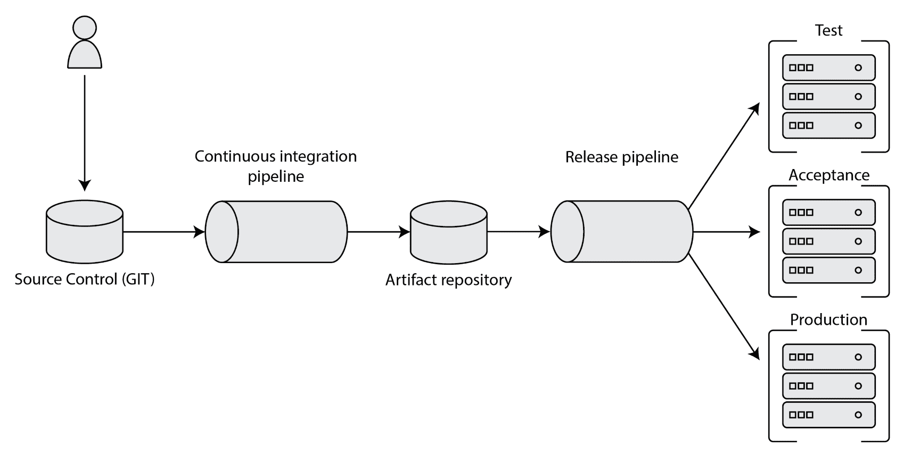

如果您以前在 DevOps 环境中工作过，这个概述看起来会很熟悉。它从连接到持续集成管道的源代码控制开始。持续集成管道产生可以部署到生产中的工件。这些工件通常存储在某个地方，用于备份和回滚。这个工件存储库连接到一个发布管道，该管道将软件部署到一个测试、验收以及最终的生产环境中。

您不需要对这个标准设置进行太多更改就可以将机器学习集成到其中。然而，当你开始使用机器学习时，有几件关键的事情是很重要的。让我们关注四个阶段，并探索如何扩展标准连续交付设置:

*   如何跟踪你用于机器学习的数据？
*   持续集成管道中的培训模型。
*   将模型部署到生产中。
*   收集生产反馈。


# 跟踪您的数据

让我们从机器学习开始:你用来训练模型的数据。机器学习很难得到好的数据。几乎 80%的工作都将放在数据管理和数据处理上。如果你每次想训练一个模特都要重做所有的工作，那真的很可悲。

这就是拥有某种形式的数据管理非常重要的原因。这可以是一个中央服务器，您可以在其中存储适合用于训练模型的数据集。如果你有超过几千兆字节的数据，它也可以是一个数据仓库。一些公司选择使用 Hadoop 或 Azure Data Lake 等工具来管理他们的数据。无论您使用什么，最重要的是保持数据集的整洁，并保持一种可用于训练的格式。

要为您的解决方案创建数据管道，您可以使用传统的**提取** **转换** **加载** ( **ETL** )工具，如 SQL server integration services，或者您可以在 Python 中构建自定义脚本，并在 Jenkins、Azure DevOps 或 Team Foundation Server 中将它们作为专用持续集成管道的一部分来执行。

数据管道将是您从各种业务来源收集数据并对其进行处理的工具，这样您就可以获得一个具有足够质量的数据集来存储为您的模型的主数据集。这里需要注意的是，尽管您可以跨不同的模型重用数据集，但最好不要一开始就考虑这个目标。当您试图在太多的使用场景中使用数据集时，您将很快发现您的主数据集将变得不干净和难以管理。


# 持续集成管道中的培训模型

一旦你有了一个基本的数据管道，是时候考虑在你的持续集成环境中集成人工智能模型的训练了。到目前为止，我们只使用 Python 笔记本来创建我们的模型。遗憾的是，Python 笔记本并不能很好地部署到生产中。您不能在构建期间自动运行它们。

在连续交付环境中，您仍然可以使用 Python 笔记本来执行初始实验，以便发现数据中的模式并构建模型的初始版本。一旦你有了一个候选模型，你将不得不把你的代码从笔记本转移到一个合适的 Python 程序中。

您可以将 Python 训练代码作为持续集成管道的一部分来运行。例如，如果您正在使用 Azure DevOps、Team Foundation Server 或 Jenkins，您已经拥有了将培训代码作为持续集成管道运行的所有工具。

我们建议将培训代码作为独立于软件其余部分的管道运行。训练一个深度学习模型通常需要很长时间，你不想把你的构建基础设施锁定在那上面。通常，你会看到人们使用专用虚拟机，甚至专用硬件来为他们的机器学习模型建立训练管道，因为训练一个模型需要大量的计算能力。

持续集成管道将基于您使用数据管道生成的数据集生成一个模型。就像代码一样，您也应该对您的模型和您用来训练它们的设置进行版本化。

跟踪您的模型和用于训练它们的设置非常重要，因为这允许您在生产中试验同一模型的不同版本并收集反馈。保留训练模型的备份也有助于在灾难(例如生产服务器崩溃)后快速恢复生产。

由于模型是二进制文件，并且可能变得非常大，所以最好将模型视为二进制工件，就像。NET，或者 Java 中的 Maven 工件。

像 Nexus 或 Artifactory 这样的工具非常适合存储模型。在 Nexus 或 Artifactory 中发布您的模型只需几行代码，将为您节省数百小时的模型再培训工作。


# 将模型部署到生产中

一旦您有了一个模型，您需要能够将它部署到生产中。如果您已经将模型存储在存储库中，如 Artifactory 或 Nexus，这就变得更容易了。您可以像创建持续集成管道一样创建专用的发布管道。在 Azure DevOps 和 Team Foundation Server 中，有一个专门的功能。在 Jenkins 中，您可以使用单独的管道将模型部署到服务器。

在发布管道中，您可以从工件存储库中下载您的模型，并将其部署到生产中。机器学习模型主要有两种部署方式。您可以将它作为一个额外的文件部署到您的应用程序中，也可以将其作为一个专用的服务组件进行部署。

如果您将您的模型作为应用程序的一部分进行部署，那么您通常只将模型存储在您的工件存储库中。模型现在变成了一个额外的工件，需要下载到部署您的解决方案的现有发布管道中。

如果您正在为您的模型部署一个专用的服务组件，您通常会将模型、使用模型进行预测的脚本以及模型所需的其他文件存储在工件存储库中，并将其部署到生产中。


# 收集对您的模型的反馈

在生产中使用深度学习或机器学习模型时，还有最后一点需要记住。你已经用某个数据集训练了模型。您希望这个数据集能够很好地代表您的生产环境中实际发生的情况。但事实并非如此，因为当你建立模型时，你周围的世界也在变化。

这就是为什么向用户征求反馈并相应地更新你的模型是很重要的。虽然不是持续部署环境的正式组成部分，但如果您想成功使用机器学习解决方案，正确设置它仍然是一个重要的方面。

建立一个反馈回路并不需要非常复杂。例如，当您对交易进行分类以进行欺诈检测时，您可以通过要求员工验证模型的结果来建立反馈循环。然后，您可以将员工的验证结果与已分类的输入一起存储。通过这样做，您可以确保您的模型不会错误地指责客户欺诈，并且它可以帮助您收集新的观察结果来改进您的模型。稍后，当您想要改进模型时，可以使用新收集的观察来扩展您的训练集。


# 存储您的模型

为了能够将您的模型部署到生产中，您需要能够在磁盘上存储一个经过训练的模型。CNTK 提供了两种在磁盘上存储模型的方法。您可以存储检查点以便以后继续训练，也可以存储模型的便携版本。这些存储方法中的每一种都有自己的用途。


# 存储模型检查点，以便在以后继续训练

有些模型需要很长时间来训练，有时一次长达数周。当你的机器在训练中崩溃，或者停电时，你不想失去你所有的进步。

这就是检查点有用的地方。您可以在训练期间使用`CheckpointConfig`对象创建一个检查点。通过修改回调列表，可以将这个附加回调添加到训练代码中，如下所示:

```
checkpoint_config = CheckpointConfig('solar.dnn', frequency=100, restore=True, preserve_all=False)

history = loss.train(
    train_datasource, 
    epoch_size=EPOCH_SIZE,
    parameter_learners=[learner], 
    model_inputs_to_streams=input_map,
    callbacks=[progress_writer, test_config, checkpoint_config],
    minibatch_size=BATCH_SIZE,
    max_epochs=EPOCHS)
```

遵循给定的步骤:

1.  首先，创建一个新的`CheckpointConfig`并为检查点模型文件提供一个文件名，在一个新的检查点之前的迷你批处理的数量应该被创建为`frequency`，并将`preserve_all`设置为`False`。
2.  接下来，在`loss`上使用 train 方法，并在`callbacks`关键字参数中提供`checkpoint_config`来使用检查点。

当您在训练期间使用检查点时，您将开始在磁盘上看到名为`solar.dnn`和`solar.dnn.ckp`的附加文件。`solar.dnn`文件包含以二进制格式存储的训练模型。`solar.dnn.ckp`文件包含训练期间使用的微型批次源的检查点信息。

当您将`CheckpointConfig`对象的恢复参数设置为`True`时，会自动恢复最近的检查点。这使得在训练代码中集成检查点变得容易。

拥有一个检查点模型不仅在训练中遇到计算机问题时有用。如果您想在从生产中收集了额外的数据后继续培训，检查点也很有用。您可以简单地恢复最新的检查点，并从那里开始向模型中输入新的样本。


# 存储便携式模型以供其他应用程序使用

尽管您可以在生产中使用检查点模型，但这样做并不明智。检查点模型以只有 CNTK 理解的格式存储。现在，可以使用二进制格式，因为 CNTK 已经存在，而且模型格式将在相当长的时间内保持兼容。但是，和所有的软件一样，CNTK 不会永远存在。

这正是 ONNX 被发明的原因。ONNX 是开放式神经网络交换格式。当您使用 ONNX 时，您以 protobuf 兼容的格式存储您的模型，许多其他框架都可以理解这种格式。甚至还有一个针对 Java 和 C#的本地 ONNX 运行时，它允许您从。NET 或 Java 应用程序。

ONNX 得到了许多大公司的支持，如脸书、英特尔、英伟达、微软、AMD、IBM 和惠普。其中一些公司为 ONNX 提供转换器，而其他公司甚至支持直接在硬件上运行 ONNX 模型，而无需使用额外的软件。NVIDIA 现在有很多芯片可以直接读取 ONNX 文件并执行这些模型。

作为一个例子，我们将首先探索如何以 ONNX 格式存储一个模型，并使用 C#再次从磁盘加载它来进行预测。首先，我们将看看如何以 ONNX 格式保存模型，然后我们将探索如何加载 ONNX 模型。


# 以 ONNX 格式存储模型

要以 ONNX 格式存储模型，您可以在`model`函数上使用`save`方法。当您没有提供任何额外的参数时，它将以用于检查点的相同格式存储模型。但是，您可以提供一个附加参数来指定模型格式，如下所示:

```
from cntk import ModelFormat

model.save('solar.onnx', format=ModelFormat.ONNX)
```

遵循给定的步骤:

1.  首先，从`cntk`包中导入`ModelFormat`枚举。
2.  接下来，用输出文件名对训练好的模型调用`save`方法，并将`ModelFormat.ONNX`指定为`format`关键字参数。


# 在 C#中使用 ONNX 模型

一旦模型存储在磁盘上，我们就可以使用 C#来加载和使用它。CNTK 版包含一个非常完整的 C # API，您可以用它来训练和评估模型。

要在 C#中使用 CNTK 模型，您需要使用一个名为`CNTK.GPU`或`CNTK.CPUOnly`的库，该库可以从. NET 的包管理器 NuGet 中检索到。CNTK 的纯 CPU 版本包括一个版本的 CNTK 二进制文件，这些文件已经编译为在 CPU 上运行模型，而 GPU 版本可以使用 GPU 和 CPU。

在 C#中加载 CNTK 模型是通过使用以下代码片段来完成的:

```
var deviceDescriptor = DeviceDescriptor.CPUDevice;
var function = Function.Load("model.onnx", deviceDescriptor, ModelFormat.ONNX);
```

遵循给定的步骤:

1.  首先，创建一个设备描述符，以便针对 CPU 执行模型。
2.  接下来，使用`Function.Load`方法加载先前存储的模型。提供`deviceDescriptor`并使用`ModelFormat.ONNX`将文件加载为 ONNX 模型。

现在我们已经加载了模型，让我们用它来做一个预测。为此，我们需要编写另一段代码:

```
public IList<float> Predict(float petalWidth, float petalLength, float sepalWidth, float sepalLength)
{
    var features = _modelFunction.Inputs[0];
    var output = _modelFunction.Outputs[0];

    var inputMapping = new Dictionary<Variable, Value>();
    var outputMapping = new Dictionary<Variable, Value>();

    var batch = Value.CreateBatch(
        features.Shape,
        new float[] { sepalLength, sepalWidth, petalLength, petalWidth },
        _deviceDescriptor);

    inputMapping.Add(features, batch);
    outputMapping.Add(output, null);

    _modelFunction.Evaluate(inputMapping, outputMapping, _deviceDescriptor);

    var outputValues = outputMapping[output].GetDenseData<float>(output);
    return outputValues[0];
}
```

遵循给定的步骤:

1.  创建一个新方法`Predict`，它接受模型的输入特性。
2.  在`Predict`方法中，将模型的输入和输出变量存储在两个独立的变量中，以便于访问。
3.  接下来，创建一个字典，将数据映射到模型的输入和输出变量。
4.  然后，创建一个新的批次，其中包含一个带有模型输入要素的样本。
5.  向输入映射添加一个新条目，以将批处理映射到输入变量。
6.  接下来，为输出变量的输出映射添加一个新条目。
7.  现在，使用输入、输出映射和设备描述符在加载的模型上调用`Evaluate`方法。
8.  最后，从输出映射中提取输出变量并检索数据。

本章的示例代码包括一个基本的 C#项目。NET core，它演示了. NET Core 项目中 CNTK 的使用。您可以在本章的代码示例目录的`csharp-client`文件夹中找到示例代码。

使用以 ONNX 格式存储的模型，可以使用 Python 来训练模型，使用 C#或其他语言来运行生产模型。这尤其有用，因为像 C#这样的语言的运行时性能比 Python 好得多。

在下一节中，我们将看看如何使用 Azure 机器学习服务来管理训练和存储模型的过程，这样我们就有了一种更加结构化的方法来处理模型。


# 使用 Azure 机器学习服务管理模型

虽然您可以完全手工构建一个持续的集成管道，但这仍然需要相当多的工作。你需要专用硬件来运行深度学习培训工作，这可能会增加成本。云中有很好的替代方案。谷歌提供 TensorFlow 服务。微软提供 Azure 机器学习服务作为管理模型的一种方式。这两个工具都很棒，我们强烈推荐。

让我们来看看 Azure 机器学习服务，以了解当您想要建立一个完整的机器学习管道时，它可以为您做些什么:

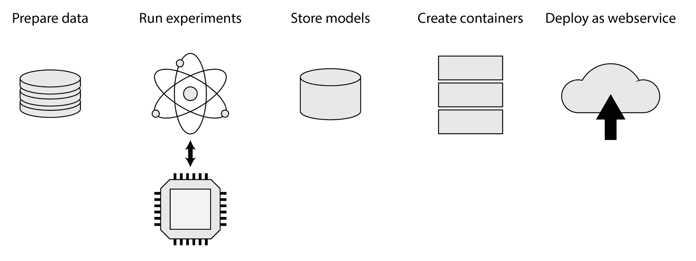

Azure 机器学习服务是一种云服务，为您的机器学习项目的每个阶段提供完整的解决方案。它有实验的概念，允许你管理实验。它具有一个模型注册表，允许您存储经过训练的模型和这些模型的 Docker 图像。您可以使用 Azure 机器学习服务工具在几分钟内将这些模型部署到生产中。


# 部署 Azure 机器学习服务

为了使用此服务，您需要在 Azure 上拥有一个有效帐户。如果你还没有一个帐户，你可以去:[https://azure.microsoft.com/en-gb/free/](https://azure.microsoft.com/en-gb/free/)使用一个试用帐户。这将给你一个 12 个月的免费帐户，价值 150 美元的信用点数，以探索不同的 Azure 服务。

有很多方法可以部署 Azure 机器学习服务。您可以通过门户创建一个新的实例，但是也可以使用云 shell 来创建服务的实例。让我们看看如何通过门户创建一个新的 Azure 机器学习服务实例。

用你最喜欢的浏览器，导航到网址:【https://portal.azure.com/[。使用您的凭据登录，您将看到一个门户，向您显示所有可用的 Azure 资源，以及一个类似于以下屏幕截图的仪表板:](https://portal.azure.com/)

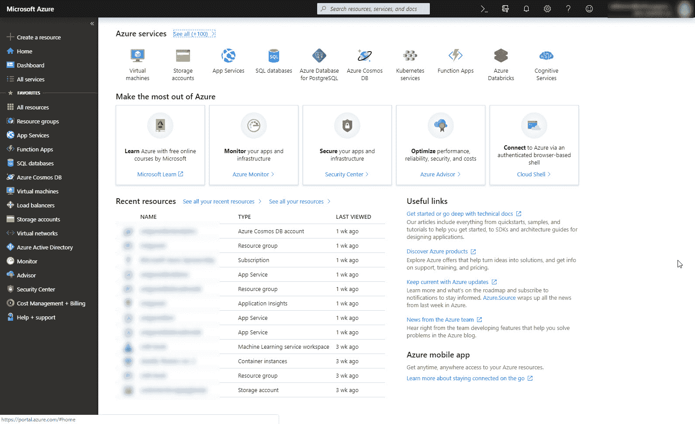

Azure 资源和仪表板

从这个门户你可以创建新的 Azure 资源，比如 Azure 机器学习工作区。点击屏幕左上角的大+按钮开始。这将显示以下页面，允许您创建新资源:

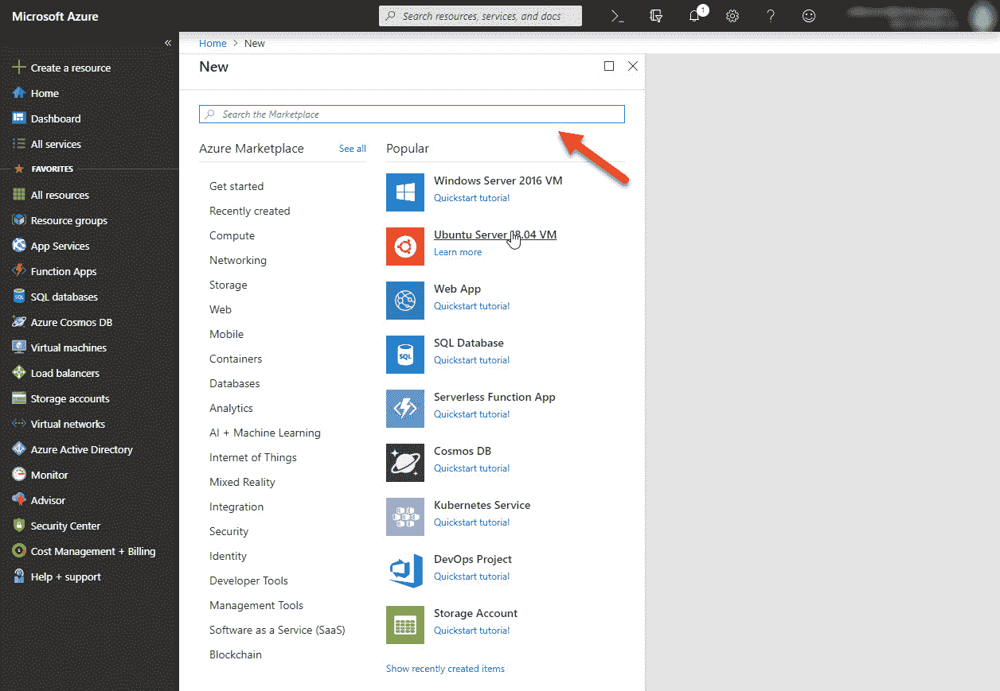

创建新资源

您可以在此搜索栏中搜索不同类型的资源。搜索 Azure Machine Learning，并从列表中选择 Azure Machine Learning 工作区资源类型。这将显示以下详细信息面板，允许您启动创建向导:

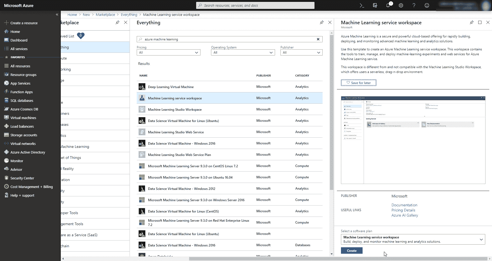

启动创建向导

该详细信息面板将解释资源的用途，并指向关于该资源的文档和其他重要信息，例如定价详细信息。要创建此资源类型的新实例，请单击“创建”按钮。这将启动向导来创建 Azure 机器学习工作区的新实例，如下所示:

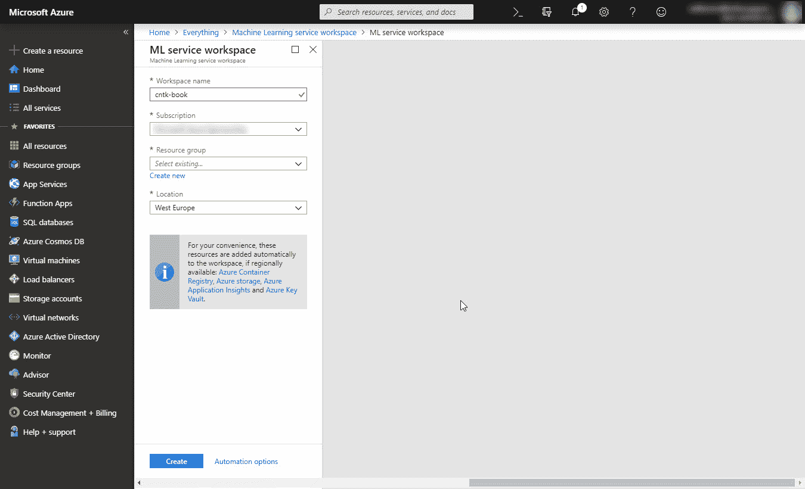

创建 Azure 机器学习工作区的新实例

在创建向导中，您可以配置工作空间的名称、它所属的资源组以及它应该创建的数据中心。Azure 资源是作为资源组的一部分创建的。这些资源组帮助您组织事物，并将相关的基础结构集中在一个地方。如果要删除一组资源，可以只删除资源组，而不是单独删除每个资源。如果您想在测试完机器学习工作区后删除所有内容，这将非常有用。

为机器学习工作区使用一个专用的资源组是一个好主意，因为它将包含不止一个资源。将这些资源与其他资源混合在一起，会使您在完成后或出于某种原因需要移动资源时更难清理。

单击屏幕底部的“创建”按钮后，机器学习工作区就创建好了。这需要几分钟时间。在后台，Azure 资源管理器将根据创建向导中的选择创建许多资源。部署完成后，您将在门户中收到通知。

创建机器学习工作区时，您可以通过门户导航到工作区，方法是首先转到屏幕左侧导航栏中门户上的资源组。接下来，单击您刚刚创建的资源组，以获得机器学习工作区和相关资源的概述，如下面的屏幕截图所示:

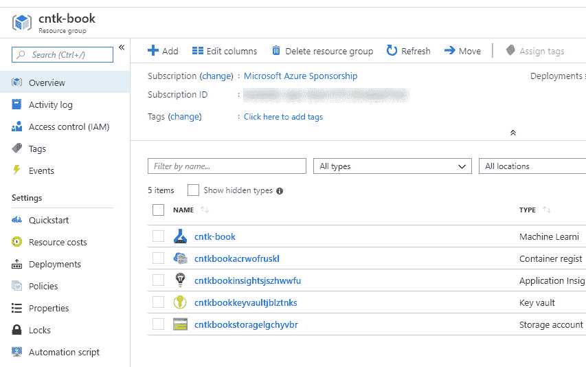

获得机器学习工作空间和相关资源的概述

有工作空间本身，有一个仪表板，允许你探索实验和管理你的机器学习解决方案的某些方面。工作区还包括一个 Docker 注册表，用于将模型存储为 Docker 图像，以及使用模型进行预测所需的脚本。当您在 Azure Portal 上检查工作区时，您还会发现一个存储帐户，您可以使用它来存储您的实验生成的数据集和数据。

Azure 机器学习服务环境中包含的一个好东西是 Application Insights 实例。您可以使用 Application Insights 来监控生产中的模型，并收集有价值的反馈以在以后改进模型。这是默认包含的，因此您不必为您的机器学习解决方案手动创建监控解决方案。


# 探索机器学习工作空间

Azure 机器学习工作区包含许多元素。让我们来探索一下，当您开始使用它时，感受一下您能得到什么:

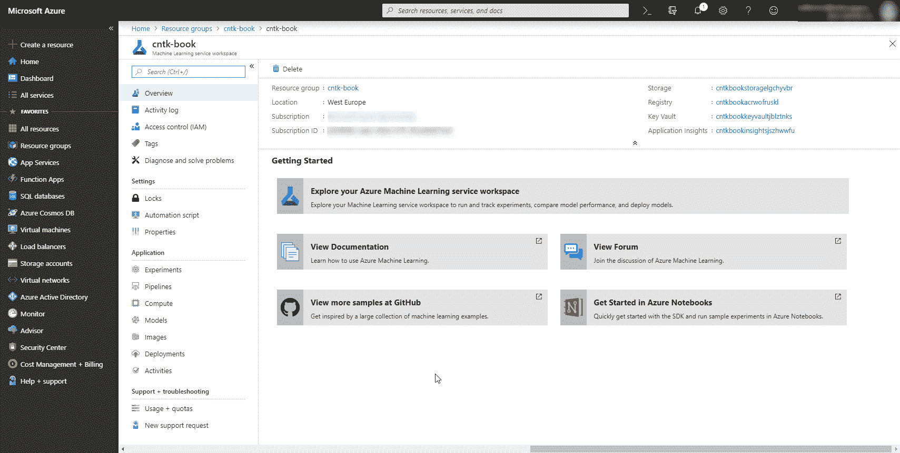

机器学习工作空间

要进入机器学习工作区，请单击屏幕左侧导航栏中的资源组项目。选择包含机器学习工作区项目的资源组，然后单击机器学习工作区。它将具有您之前在创建向导中配置的名称。

在工作区，有一个专门的实验区。这个部分将提供对您在工作区中运行的实验的访问，以及关于作为实验的一部分而执行的运行的细节。

机器学习工作区的另一个有用元素是模型部分。当您训练了一个模型之后，您可以将它存储在模型注册表中，以便以后可以将其部署到生产环境中。模型会自动连接到生成它的实验运行，因此您可以随时追溯到使用了哪些代码来生成模型，以及使用了哪些设置来训练它。

模型部分下面是图像部分。这一部分向您展示了从您的模型中创建的 Docker 图像。您可以将 Docker 映像中的模型与评分脚本打包在一起，以使部署到生产环境中变得更加容易和更加可预测。

最后，部署部分包含所有基于映像的部署。如果您需要扩展您的模型部署，您可以使用 Azure Machine Learning service 使用单个容器实例、虚拟机甚至 Kubernetes 集群将模型部署到生产环境中。

Azure 机器学习服务还提供了一种技术，允许您建立一个管道来准备数据，训练模型，并将其部署到生产中。如果您希望构建一个包含预处理步骤和训练步骤的单一流程，这个特性会很有用。在您需要执行许多步骤来获得一个训练好的模型的情况下，它尤其强大。现在，我们将限制自己运行基本的实验，并将结果模型部署到生产 Docker 容器实例中。


# 运行您的第一个实验

现在您有了一个工作空间，让我们看看如何从 Python 笔记本中使用它。我们将修改一些深度学习代码，以便将训练好的模型保存到 Azure 机器学习服务工作区，作为实验的输出，并跟踪模型的指标。

首先，我们需要如下安装`azureml`包:

```
pip install --upgrade azureml-sdk[notebooks]
```

`azureml`包包含运行实验所需的组件。为了让它工作，你需要在你的机器学习项目的根目录下创建一个名为`config.json`的文件。如果您正在使用本章的示例代码，您可以修改`azure-ml-service`文件夹中的`config.json`文件。它包含以下内容:

```
{
    "workspace_name": "<workspace name>",
    "resource_group": "<resource group>",
    "subscription_id": "<your subscription id>"
}
```

该文件包含 Python 代码将使用的工作空间、包含您正在使用的工作空间的资源组以及创建工作空间的订阅。工作区名称应该与您之前在向导中选择的创建工作区的名称相匹配。资源组应该与包含工作区的资源组相匹配。最后，您需要找到订阅 ID。

导航到门户上机器学习工作区的资源组时，您将在资源组详细信息面板的顶部看到订阅 ID，如以下屏幕截图所示:


资源组详细信息面板顶部的订阅 ID

当您将鼠标悬停在订阅 ID 的值上时，门户将显示一个按钮，将该值复制到您的剪贴板。将该值粘贴到配置文件的 subscriptionId 字段中并保存。现在，您可以使用以下小段代码从任何 Python 笔记本或 Python 程序连接到您的工作空间:

```
from azureml.core import Workspace, Experiment

ws = Workspace.from_config()
experiment = Experiment(name='classify-flowers', workspace=ws)
```

遵循给定的步骤:

1.  首先，我们基于刚刚创建的配置文件创建一个新的工作区。这连接到 Azure 中的工作区。一旦连接上，您就可以用自己选择的名称创建一个新实验，并将其连接到工作区。
2.  接下来，创建一个新的实验，并将其连接到工作区。

Azure 机器学习服务中的一个实验可以用来跟踪你用 CNTK 测试的架构。例如，您可以为卷积神经网络创建一个实验，并创建第二个实验来尝试用循环神经网络解决相同的问题。

让我们探索如何跟踪度量和实验的其他输出。我们将使用前面章节中的 iris 花卉分类模型，并扩展训练逻辑来跟踪指标，如下所示:

```
from cntk import default_options, input_variable
from cntk.layers import Dense, Sequential
from cntk.ops import log_softmax, sigmoid

model = Sequential([
    Dense(4, activation=sigmoid),
    Dense(3, activation=log_softmax)
])

features = input_variable(4)
z = model(features)
```

遵循给定的步骤:

1.  首先，导入`default_options`和`input_variable`函数。
2.  接下来，从`cntk.layers`模块导入模型的图层类型。
3.  之后，从`cntk.ops`模块导入`log_softmax`和`sigmoid`激活功能。
4.  创建一个新的`Sequential`图层组。
5.  在设置了 4 个神经元和`sigmoid`激活函数的`Sequential`层上添加一个新的`Dense`层。
6.  添加另一个具有 3 个输出和一个`log_softmax`激活功能的`Dense`层。
7.  创建一个大小为 4 的新`input_variable`。
8.  用`features`变量调用模型来完成模型。

为了训练模型，我们将使用手动迷你批次循环。首先，我们必须加载并预处理 iris 数据集，以便它匹配我们的模型所期望的格式，如下面的代码片段所示:

```
import pandas as pd
import numpy as np

df_source = pd.read_csv('iris.csv', 
    names=['sepal_length', 'sepal_width','petal_length','petal_width', 'species'], 
    index_col=False)

X = df_source.iloc[:, :4].values
y = df_source['species'].values
```

遵循给定的步骤:

1.  导入`pandas`和`numpy`模块，加载包含训练样本的 CSV 文件。
2.  使用 read_csv 函数加载包含训练数据的输入文件。
3.  接下来，提取前 4 列作为输入特征
4.  最后，提取物种列作为标签

标签存储为字符串，因此我们必须将它们转换为一组热点向量，以便与模型匹配，如下所示:

```
label_mapping = {
    'Iris-setosa': 0,
    'Iris-versicolor': 1,
    'Iris-virginica': 2
}

def one_hot(index, length):
    result = np.zeros(length)
    result[index] = 1.

y = [one_hot(label_mapping[v], 3) for v in y]
```

遵循给定的步骤:

1.  创建从标签到其数字表示的映射。
2.  接下来，定义一个新的效用函数`one_hot`，将一个数值编码成一个独热向量。
3.  最后，使用 python list comprehension 来迭代 labels 集合中的值，并将它们转换成一次性编码的向量。

我们需要再执行一个步骤来准备用于训练的数据集。为了能够验证模型确实得到了正确的优化，我们想要创建一个拒绝集，我们将针对它运行一个测试:

```
from sklearn.model_selection import train_test_split

X_train, X_test, y_train, y_test = train_test_split(X,y, test_size=0.2, stratify=y)
```

使用`train_test_split`方法，创建一个包含 20%训练样本的小型保留集。使用`stratify`关键字并提供标签来平衡分割。

一旦我们准备好数据，我们就可以专注于训练模型。首先，我们需要设置一个`loss`函数、`learner`和`trainer`，如下所示:

```
from cntk.losses import cross_entropy_with_softmax
from cntk.metrics import classification_error
from cntk.learners import sgd
from cntk.train.trainer import Trainer

label = input_variable(3)

loss = cross_entropy_with_softmax(z, label)
error_rate = classification_error(z, label)

learner = sgd(z.parameters, 0.001)
trainer = Trainer(z, (loss, error_rate), [learner])
```

1.  从`cntk.losses`模块导入 cross_entropy_with_softmax 函数。
2.  接下来，从`cnkt.metrics`模块导入 classificatin _ error 函数。
3.  然后，从`cntk.learners`模块导入`sgd`学习器。
4.  创建一个形状为 3 的新`input_variable`来存储标签
5.  接下来，创建 cross_entropy_with_softmax loss 的新实例，并为其提供模型变量`z`和`label`变量。
6.  然后，使用 classification_error 函数创建一个新的度量，并为其提供网络和`label`变量。
7.  现在，用网络的参数初始化`sgd`学习器，将其学习率设置为 0.001。
8.  最后，用网络初始化`Trainer`、`loss`、`metric`和`learner`。

通常，我们可以在`loss`函数上使用`train`方法来优化我们模型中的参数。然而，这一次，我们希望控制培训过程，这样我们就可以在 Azure Machine Learning workspace 中注入逻辑来跟踪指标，如以下代码片段所示:

```
import os
from cntk import ModelFormat

with experiment.start_logging() as run:
    for _ in range(10):
        trainer.train_minibatch({ features: X_train, label: y_train })

        run.log('average_loss', trainer.previous_minibatch_loss_average)
        run.log('average_metric', trainer.previous_minibatch_evaluation_average)

    test_metric = trainer.test_minibatch( {features: X_test, label: y_test })
```

遵循给定的步骤:

1.  要开始新的运行，调用实验中的`start_logging`方法。这将创建一个新的`run`。在运行范围内，我们可以执行训练逻辑。
2.  创建一个新的 for 循环来训练 10 个时期。
3.  在 for 循环中，调用`trainer`上的`train_minibatch`方法来训练模型。为它提供输入变量和训练数据之间的映射。
4.  之后，使用教练对象中的`previous_minibatch_loss_average`值记录跑步的`average_loss`指标。
5.  除了平均损失，使用 trainer 对象上的`previous_minibatch_evaluation_average`属性记录跑步中的平均指标。

一旦我们训练了模型，我们就可以使用`test_minibatch`方法对测试集执行测试。这个方法返回我们之前创建的`metric`函数的输出。我们也会将此记录到机器学习工作区。

运行允许我们跟踪与模型的单个训练会话相关的数据。我们可以在`run`对象上使用`log`方法记录度量。该方法接受指标的名称和指标的值。您可以使用这个方法来记录诸如`loss`函数的输出之类的东西，以监控您的模型是如何收敛到一组最佳参数的。

还可以记录其他内容，例如用于训练模型的历元数、程序中使用的随机种子以及其他有用的设置，您可能需要这些设置以便在以后重现实验。

当您导航到实验选项卡下的机器学习工作区中的实验时，运行期间记录的指标会自动显示在门户上，如下图所示。

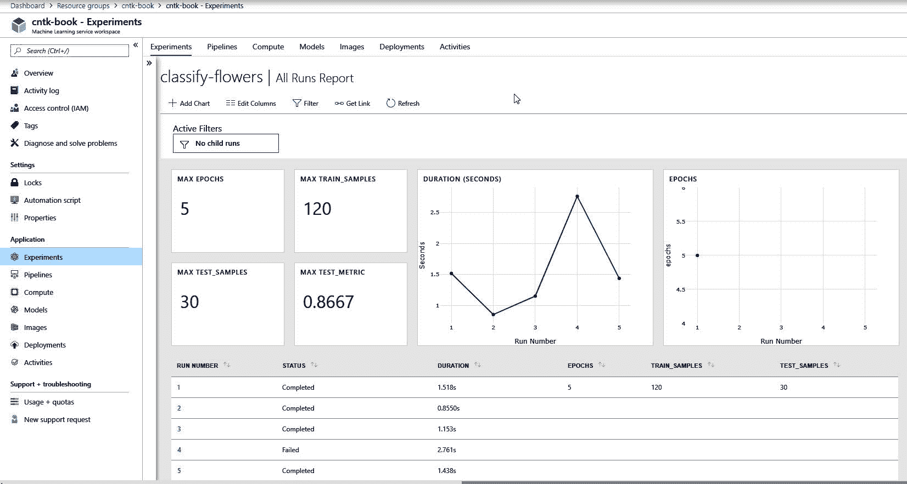

导航到实验选项卡下机器学习工作区中的实验

除了`log`方法之外，还有一个`upload_file`方法来上传训练期间生成的文件，如下面的代码片段所示。您可以使用此方法来存储培训完成后保存的模型文件:

```
z.save('outputs/model.onnx') # The z variable is the trained model
run.upload_file('model.onnx', 'outputs/model.onnx')
```

`upload_file`方法需要一个文件名，因为它可以在工作区中找到，还需要一个本地路径，在那里可以找到源文件。请注意文件的位置。由于 Azure Machine Learning workspace 的限制，它只会从 outputs 文件夹中提取文件。这一限制将来可能会取消。

确保在运行范围内执行`upload_file`方法，以便 AzureML 库将模型链接到您的实验运行，从而使其可跟踪。

将文件上传到工作空间后，您可以在运行的 outputs 部分下的门户中找到它。要获得运行细节，请在 Azure Portal 中打开机器学习工作区，导航到实验，然后选择您想要查看其细节的运行，如下所示:

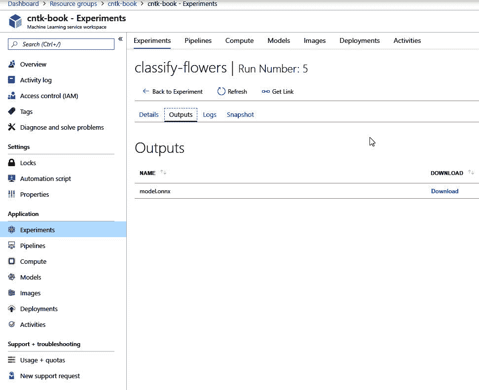

选择管路

最后，当您完成运行并想要发布模型时，您可以在模型注册表中注册它，如下所示:

```
stored_model = run.register_model(model_name='classify_flowers', model_path='model.onnx')
```

`register_model`方法将模型存储在模型注册中心，这样您就可以将它部署到生产中。当模型先前存储在注册表中时，它将自动存储为新版本。现在，如果需要，您可以随时返回到以前的版本，如下所示:

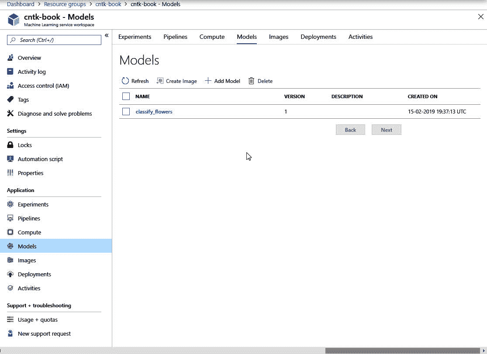

存储为新版本的模型

你可以在工作区的模型注册表中找到模型，方法是转到 Azure Portal 上的机器学习工作区，然后在工作区的导航菜单中点击栏中的模型项。

模型会自动与实验运行相关联，因此您总是可以找到用于训练模型的设置。这很重要，因为它增加了您在需要时重现结果的机会。

我们仅限于在本地进行实验。如果你愿意，你可以使用 Azure 机器学习在专用硬件上运行实验。你可以在 Azure 机器学习文档网站上了解更多信息:[https://docs . Microsoft . com/en-us/Azure/Machine-Learning/service/how-to-set-up-training-targets](https://docs.microsoft.com/en-us/azure/machine-learning/service/how-to-set-up-training-targets)。

一旦您完成了一次实验运行，您就可以将训练好的模型部署到生产中。在下一节中，我们将探索如何做到这一点。


# 将您的模型部署到生产中

Azure 机器学习的最后一个有趣部分是它包含的部署工具。部署工具允许您从模型注册中心获取模型，并将其部署到生产环境中。

在将模型部署到生产环境之前，您需要有一个包含模型和评分脚本的图像。该图像是一个 Docker 图像，它包含一个 web 服务器，当对它发出请求时，它将调用评分脚本。评分脚本接受 JSON 有效负载形式的输入，并使用它通过模型进行预测。我们的虹膜分类模型的评分脚本如下所示:

```
import os
import json
import numpy as np
from azureml.core.model import Model
import onnxruntime

model = None

def init():
    global model

    model_path = Model.get_model_path('classify_flowers')
    model = onnxruntime.InferenceSession(model_path)

def run(raw_data):
    data = json.loads(raw_data)
    data = np.array(data).astype(np.float32)

    input_name = model.get_inputs()[0].name
    output_name = model.get_outputs()[0].name

    prediction = model.run([output_name], { input_name: data})

    # Select the first output from the ONNX model.
    # Then select the first row from the returned numpy array.
    prediction = prediction[0][0]

    return json.dumps({'scores': prediction.tolist() })
```

遵循给定的步骤:

1.  首先，导入构建脚本所需的组件。
2.  接下来，定义一个包含加载模型的全局模型变量。
3.  之后，定义 init 函数来初始化脚本中的模型。
4.  在 init 函数中，使用`Model.get_model_path`函数检索模型的路径。这将自动定位 Docker 映像中的模型文件。
5.  接下来，通过初始化`onnxruntime.InferenceSession`类的新实例来加载模型。
6.  定义另一个函数，`run`，它接受单个参数`raw_data`。
7.  在`run`函数中，将`raw_data`变量的内容从 JSON 转换为 Python 数组。
8.  接下来，将`data`数组转换成 Numpy 数组，这样我们就可以用它来进行预测。
9.  之后，对加载的模型使用`run`方法，并输入输入特征。包括一个字典，告诉 ONNX 运行时如何将输入数据映射到模型的输入变量。
10.  该模型返回一个输出数组，其中 1 个元素用于模型的输出。该输出包含一行数据。从输出数组中选择第一个元素，从所选输出变量中选择第一行，并将其存储在`prediction`变量中。
11.  最后，将预测的输出作为 JSON 对象返回。

Azure Machine Learning service 将在您创建容器映像时自动包含您为特定模型注册的任何模型文件。因此，`get_model_path`也将在部署的图像中工作，并解析到托管模型和评分脚本的容器中的一个目录。

现在我们有了一个评分脚本，让我们创建一个图像，并将该图像作为 web 服务部署到云中。要部署 web 服务，您可以显式创建一个映像。或者，您可以让 Azure 机器学习服务基于您提供的配置创建一个，如下所示:

```
from azureml.core.image import ContainerImage

image_config = ContainerImage.image_configuration(
    execution_script="score.py", 
    runtime="python", 
    conda_file="conda_env.yml")
```

遵循给定的步骤:

1.  首先，从`azureml.core.image`模块导入 ContainerImage 类。
2.  接下来，使用`ContainerImage.image_configuration`方法创建一个新的映像配置。提供 score.py 作为参数`execution_script`，python `runtime`，最后提供 conda_env.yml 作为图片的`conda_file`。

我们将容器映像配置为使用 Python 作为运行时。我们还为 Anaconda 配置了一个特殊的环境文件，这样我们就可以配置像 CNTK 这样的定制模块，如下所示:

```
name: project_environment
dependencies:
  # The python interpreter version.
  # Currently Azure ML only supports 3.5.2 and later.
- python=3.6.2

- pip:
    # Required packages for AzureML execution, history, and data preparation.

  - azureml-defaults
  - onnxruntime
```

遵循给定的步骤:

1.  首先，给环境一个名字。这是可选的，但是当您在本地从这个文件创建一个环境进行测试时，这是非常有用的。
2.  接下来，为您的评分脚本提供 python 版本 3.6.2。
3.  最后，用包含`azureml-default`和`onnxruntime`的子列表向列表添加一个 pip 依赖项。

`azureml-default`包包含了在 docker 容器映像中处理实验和模型所需的一切。它包括像 Numpy 和 Pandas 这样的标准包，以便于安装。需要`onnxruntime`包，这样我们就可以将模型加载到我们正在使用的评分脚本中。

还需要一个步骤来将训练好的模型部署为 web 服务。我们需要设置一个 web 服务配置，并将模型作为服务进行部署。机器学习服务支持部署到虚拟机、Kubernetes 集群和 Azure 容器实例，它们是运行在云中的基本 Docker 容器。这是将模型部署到 Azure 容器实例的方法:

```
from azureml.core.webservice import AciWebservice, Webservice

aciconfig = AciWebservice.deploy_configuration(cpu_cores=1, memory_gb=1)

service = Webservice.deploy_from_model(workspace=ws,
                                       name='classify-flowers-svc',
                                       deployment_config=aciconfig,
                                       models=[stored_model],
                                       image_config=image_config)
```

遵循给定的步骤:

1.  首先，从 azureml.core.webservice 模块导入 AciWebservice 和 Webservice 类。
2.  然后，使用 AziWebservice 类上的 deploy_configuration 方法创建一个新的`AciWebservice`配置。为 it 部门提供一组软件资源限制。一个 CPU 和 1GB 内存。
3.  一旦有了 web 服务的配置，就可以通过调用`deploy_from_model`将注册的模型部署到生产环境中，其中包含要部署的工作区、服务名和您想要部署的模型。提供您之前创建的映像配置。

一旦创建了容器映像，它将作为容器实例部署在 Azure 上。这将在机器学习工作区的资源组中创建新资源。

一旦新服务启动，您将在机器学习工作区的 Azure Portal 上看到一个新的部署，如下面的截图所示:

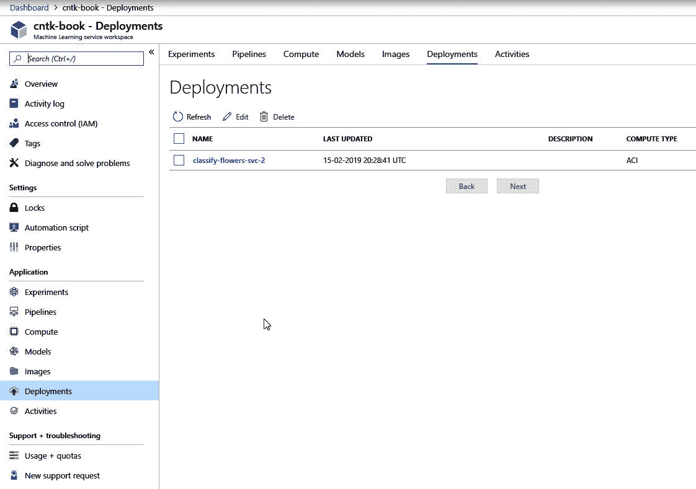

机器学习工作区中 Azure 门户上的新部署

该部署包括一个评分 URL，您可以从应用程序中调用该 URL 来使用该模型。因为您使用 REST 来调用模型，所以您与它在幕后运行 CNTK 的事实是隔离的。您还可以使用任何您能想到的编程语言，只要它能执行 HTTP 请求。

例如，在 Python 中，我们可以使用`requests`包作为基本的 REST 客户端，使用您刚刚创建的服务进行预测。让我们首先安装`requests`模块，如下所示:

```
pip install --upgrade requests
```

安装了`requests`包后，我们可以编写一个小脚本来执行针对已部署服务的请求，如下所示:

```
import requests
import json

service_url = "<service-url>"
data = [[1.4, 0.2, 4.9, 3.0]]

response = requests.post(service_url, json=data)

print(response.json())
```

遵循给定的步骤:

1.  首先，导入请求和 json 包。
2.  接下来，为 service_url 创建一个新变量，并用 webservice 的 url 填充它。
3.  然后，创建另一个变量，以存储您要进行预测的数据。
4.  之后，使用 requests.post 函数将数据发送到已部署的服务并存储响应。
5.  最后，读取响应中返回的 JSON 数据以获得预测值。

可以通过执行以下步骤来获取 service_url:

1.  首先，导航到包含机器学习工作区的资源组。
2.  然后，选择工作区，并选择细节面板左侧的部署部分。
3.  选择要查看其详细信息的部署，并从详细信息页面复制 URL。

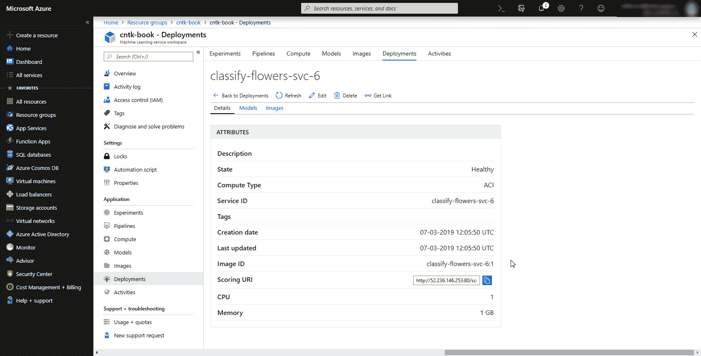

选择部署

当您运行刚刚创建的脚本时，您将收到一个响应，其中包含输入样本的预测类。输出如下所示:

```
{"scores": [-2.27234148979187, -2.486853837966919, -0.20609207451343536]}
```


# 摘要

在这一章中，我们已经了解了如何将深度学习和机器学习模型应用到生产中。我们已经探索了一些基本原则，这些原则将帮助您在持续交付环境中成功地进行深度学习。

由于 ONNX 格式的可移植性，我们已经了解了如何将模型导出到 ONNX，以便更容易地将训练好的模型部署到生产中，并保持它们运行多年。然后，我们探索了如何在其他语言(如 C#)中使用 CNTK API 进行预测。

最后，我们看了如何使用 Azure 机器学习服务来提升您在实验管理、模型管理和部署工具方面的 DevOps 体验。虽然你不需要这样的工具来开始，但当你计划运行一个更大的生产项目时，在你的军火库中拥有像 Azure Machine Learning service 这样的东西真的很有帮助。

到了这一章，我们已经到了这本书的结尾。第一章，我们开始探索 CNTK。然后，我们看了如何建立模型，向它们提供数据，并测量它们的性能。在了解了基础知识之后，我们探索了两个有趣的用例，查看图像和时间序列数据。最后，我们将模型投入生产。现在你应该有足够的信息开始用 CNTK 构建你自己的模型！