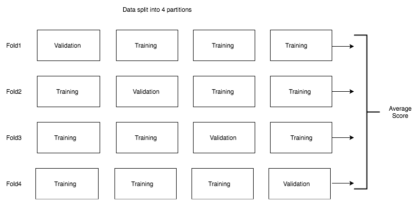
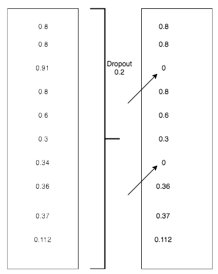
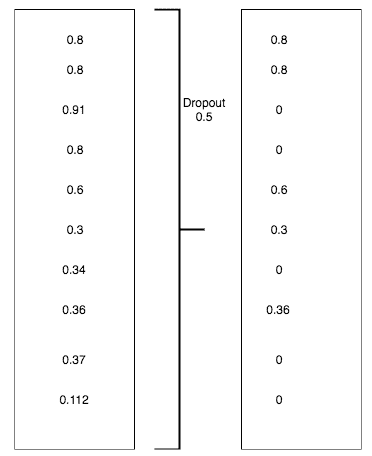

# 三、机器学习基础

在前面的章节中，我们看到了如何建立深度学习模型来解决分类和回归问题的实际例子，例如图像分类和平均用户视图预测。类似地，我们对如何构建深度学习问题产生了直觉。在这一章中，我们将看看如何解决不同类型的问题和不同的调整，我们最终可能会使用它们来提高我们的模型在我们的问题上的性能。

在本章中，我们将探索:

*   分类和回归之外的其他形式的问题
*   评估中的问题，理解过拟合、欠拟合以及解决这些问题的技术
*   为深度学习准备数据

请记住，我们在本章讨论的大多数主题都是机器学习和深度学习的共同主题，除了一些我们用来解决过度拟合问题的技术——如辍学。

# 三种机器学习问题

在我们之前的所有例子中，我们试图解决分类(预测猫或狗)或回归(预测用户在平台上花费的平均时间)问题。所有这些都是监督学习的例子，其目标是绘制训练样本和它们的目标之间的关系，并使用它对看不见的数据进行预测。

监督学习只是机器学习的一部分，机器学习还有其他不同的部分。有三种不同的机器学习:

*   监督学习
*   无监督学习
*   强化学习

让我们详细看看算法的种类。

# 监督学习

深度学习和机器学习领域的大多数成功用例都属于监督学习。我们在本书中涉及的大多数例子也将是这个的一部分。监督学习的一些常见例子有:

*   **分类问题**:给狗和猫分类。
*   **回归问题**:预测股票价格、板球比赛比分等等。
*   **图像分割**:做像素级分类。对于自动驾驶汽车来说，从其摄像头拍摄的照片中识别每个像素属于什么非常重要。像素可以属于汽车、行人、树、公共汽车等等。
*   **语音识别**:好的谷歌、Alexa、Siri 都是语音识别的好例子。
*   **语言翻译**:将语音从一种语言翻译成另一种语言。

# 无监督学习

当没有标签数据时，无监督学习技术通过可视化和压缩来帮助理解数据。无监督学习中两种常用的技术是:

*   使聚集
*   降维

聚类有助于将所有相似的数据点组合在一起。降维有助于减少维度的数量，这样我们就可以可视化高维数据来发现任何隐藏的模式。

# 强化学习

强化学习是最不受欢迎的机器学习类别。它没有在现实世界的用例中获得成功。然而，近年来情况发生了变化，来自谷歌 DeepMind 的团队能够成功构建基于强化学习的系统，并能够在 AlphaGo 比赛中战胜世界冠军。这种技术进步，即计算机可以在游戏中击败人类，被认为需要几十年以上的时间才能实现。然而，深度学习结合强化学习能够比任何人预期的更快地实现它。这些技术已经初见成效，可能还需要几年时间才能成为主流。

在本书中，我们将主要关注深度学习特有的监督技术和一些非监督技术，例如用于创建特定风格图像的生成网络，称为**风格转移**和**生成对抗网络**。

# 机器学习词汇表

在过去的几章中，我们使用了很多术语，如果你刚刚进入机器学习或深度学习领域，这些术语对你来说可能是全新的。我们会列出很多机器学习中常用的术语，这些术语在深度学习文献中也会用到:

*   **样本** **或输入或** **数据点**:这些表示训练一个集合的特定实例。在我们上一章看到的图像分类问题中，每幅图像都可以被称为样本、输入或数据点。
*   **预测** **或** **输出**:我们的算法生成的值作为输出。例如，在我们之前的示例中，我们的算法将特定图像预测为 0，这是给予 cat 的标签，因此数字 0 是我们的预测或输出。
*   **目标** **或标签**:图像的实际标记标签。
*   **损失值** **或预测误差**:预测值与实际值之间距离的某种度量。值越小，精确度越高。
*   **类**:给定数据集的一组可能的值或标签。在上一章的例子中，我们有两个类——猫和狗。
*   **二元分类**:一个分类任务，其中每个输入的例子应该被分类为两个排他类别中的一个。
*   **多类分类**:一个分类任务，其中每个输入的例子可以被分成两个以上不同的类别。
*   **多标签分类**:一个输入的例子可以用多个标签来标记——例如，用它提供的不同类型的食物来标记一个餐馆，比如意大利菜、墨西哥菜和印度菜。另一个常用的例子是图像中的目标检测，其中算法识别图像中的不同对象。
*   **标量回归**:每个输入数据点都会关联一个标量质量，是一个数字。一些例子可能是预测房价、股票价格和板球比分。
*   **向量回归**:算法需要预测多个标量的情况。一个很好的例子是，当您试图识别图像中包含鱼的位置的边界框时。为了预测边界框，您的算法需要预测表示正方形边缘的四个标量。
*   **批处理**:在大多数情况下，我们在一组输入样本上训练我们的算法，称为批处理。批量大小通常从 2 到 256 不等，取决于 GPU 的内存。每一批的权重也会更新，因此这些算法往往比在单个例子上训练时学习得更快。
*   **时期**:在一个完整的数据集上运行算法被称为**时期**。通常训练(更新权重)几个时期。

# 评估机器学习模型

在我们上一章讨论的图像分类的例子中，我们将数据分成两个不同的部分，一部分用于训练，一部分用于验证。使用单独的数据集来测试算法的性能是一种很好的做法，因为在训练集上测试算法可能无法提供算法真正的泛化能力。在大多数真实世界的用例中，基于验证的准确性，我们经常以不同的方式调整我们的算法，比如增加更多的层或者不同的层，或者使用不同的技术，我们将在本章的后面部分介绍。因此，您调整算法的选择更有可能是基于验证数据集。以这种方式训练的算法往往在训练数据集和验证数据集中表现良好，但在看不见的数据上不能很好地推广。这是由于您的验证数据集的信息泄漏，影响了我们对算法的调整。

为了避免信息泄露的问题并提高泛化能力，通常的做法是将数据集分成三个不同的部分，即训练、验证和测试数据集。我们进行训练，并使用训练和验证集进行算法的所有超参数调整。最后，当整个训练完成后，您将在测试数据集上测试该算法。我们讨论了两种类型的参数。一个是算法中使用的参数或权重，由优化器或在反向传播过程中进行调整。另一组参数称为**超级参数**，控制网络中使用的层数、学习速率和其他类型的参数，这些参数通常会改变架构，通常是手动完成的。

特定算法在训练集中表现更好，而在验证或测试集中表现不佳的现象被称为**过拟合**，或算法泛化能力的缺乏。有一种相反的现象，即算法无法对训练集执行，这被称为**欠拟合**。我们将着眼于不同的策略，这将有助于我们克服过度拟合和拟合不足的问题。

在研究过度拟合和欠拟合之前，让我们先来看看分割数据集的各种策略。

# 培训、验证和测试分割

最佳做法是将数据分为三部分，即训练数据集、验证数据集和测试数据集。使用维持数据集的最佳方法是:

1.  在训练数据集上训练算法
2.  基于验证数据集执行超参数调整
3.  反复执行前两步，直到达到预期的性能
4.  冻结算法和超参数后，在测试数据集上对其进行评估

避免将数据分成两部分，因为这可能会导致信息泄露。在同一个数据集上训练和测试它显然是不允许的，因为它不能保证算法的通用性。有三种流行的维持策略可用于将数据分为定型集和验证集。它们如下:

*   简单维持验证
*   k 倍验证
*   迭代 k 倍验证

# 简单维持验证

留出一部分数据作为测试数据集。保留哪一部分可能因问题而异，很大程度上取决于可用的数据量。对于特别是计算机视觉和 NLP 领域的问题，收集标记数据可能非常昂贵，因此保留 30%的大部分可能会使算法难以学习，因为它将有更少的数据进行训练。因此，根据数据的可用性，明智地选择它的一部分。一旦测试数据被分割，保持分开，直到你冻结算法和它的超参数。要为问题选择最佳超参数，请选择单独的验证数据集。为了避免过度拟合，我们通常将可用数据分为三个不同的集合，如下图所示:


我们使用上一章中上图的一个简单实现来创建我们的验证集。让我们看一下实现的快照:

```py
files = glob(os.path.join(path,'*/*.jpg'))
no_of_images = len(files)
shuffle = np.random.permutation(no_of_images)
train = files[shuffle[:int(no_of_images*0.8)]]
valid = files[shuffle[int(no_of_images*0.8):]]
```

这是最简单的拒绝策略之一，通常用于开始。对小数据集使用这种方法有一个缺点。验证数据集或测试数据集可能无法从统计角度代表手头的数据。我们可以很容易地认识到这一点。如果得到的结果不一致，那么我们需要使用更好的方法。为了避免这个问题，我们经常使用 k-fold 或迭代 k-fold 验证。

# k 倍验证

保留数据集的一部分用于测试分割，然后将整个数据集分成 k 倍，其中 k 可以是任何数字，通常从 2 到 10 不等。在任何给定的迭代中，我们保留一个块进行验证，并在其余的块上训练算法。最终分数通常是所有 k 倍分数的平均值。下图显示了 k 倍验证的实现，其中 k 为 4；也就是说，数据被分成四部分:



使用 k-fold 验证数据集时需要注意的一个关键问题是，它非常昂贵，因为您要在数据集的不同部分多次运行该算法，这对于计算密集型算法来说可能非常昂贵，特别是在计算机视觉算法领域，有时训练一个算法可能需要几分钟到几天的时间。所以，明智地使用这个技巧。

# 混洗的 k 倍验证

为了使事情变得复杂和健壮，您可以在每次创建维持验证数据集时打乱数据。它非常有助于解决性能的微小提升可能会对业务产生巨大影响的问题。如果您的情况是快速构建和部署算法，并且您可以接受牺牲几个百分点的性能差异，那么这种方法可能不值得。这一切都归结于你试图解决什么问题，以及准确性对你意味着什么。

拆分数据时，您可能需要考虑其他一些事情，例如:

*   数据代表性
*   时间敏感性
*   数据冗余

# 数据代表性

在我们上一章看到的例子中，我们将图像分类为狗或猫。让我们来看一个场景，其中所有的图像都被排序，前 60%的图像是狗，其余的是猫。如果我们通过选择前 80%作为训练数据集，其余的作为验证集来分割该数据集，则验证数据集将不会是数据集的真实表示，因为它将仅包含 cat 图像。因此，在这些情况下，应该注意在分割或进行分层抽样之前，先对数据进行洗牌，以确保我们有一个良好的组合。分层抽样是指从每个类别中选取数据点，以创建验证和测试数据集。

# 时间敏感性

让我们以预测股票价格为例。我们有一月到十二月的数据。在这种情况下，如果我们进行随机或分层抽样，那么我们最终会出现信息泄露，因为价格可能对时间敏感。因此，创建验证数据集时要确保没有信息泄漏。在这种情况下，选择 12 月的数据作为验证数据集可能更有意义。对于股票价格，情况要比这复杂得多，因此在选择验证分割时，特定领域的知识也会发挥作用。

# 数据冗余

重复在数据中很常见。应注意确保定型、验证和测试集中的数据是唯一的。如果有重复的，那么模型可能不能很好地概括看不见的数据。

# 数据预处理和特征工程

我们研究了分割数据集的不同方法，以构建我们的评估策略。在大多数情况下，我们收到的数据可能不是我们可以用来训练算法的格式。在这一节中，我们将介绍一些预处理技术和特征工程技术。尽管大多数特征工程技术都是特定领域的，特别是在计算机视觉和文本领域，但也有一些通用的特征工程技术，我们将在本章中讨论。

神经网络的数据预处理是我们使数据更适合深度学习算法进行训练的过程。以下是一些常用的数据预处理步骤:

*   …向量化…
*   正常化
*   缺少值
*   特征抽出

# …向量化…

数据有多种格式，如文本、声音、图像和视频。首先要做的是将数据转换成 PyTorch 张量。在前面的例子中，我们使用了`torchvision`实用函数将 **Python 图像库** ( **PIL** )图像转换为张量对象，尽管 PyTorch torchvision 库抽象掉了大部分复杂性。在[第七章](6.html)、*生成网络*中，我们在处理**循环神经网络** ( **RNNs** )时，会看到文本数据是如何转换成 PyTorch 张量的。对于涉及结构化数据的问题，数据已经以矢量化格式呈现；我们只需要把它们转换成 PyTorch 张量。

# 价值标准化

在将数据传递给任何机器学习算法或深度学习算法之前，通常会对特征进行归一化。它有助于更快地训练算法，并有助于实现更高的性能。归一化是以均值为零、标准差为一的方式表示属于特定要素的数据的过程。

在*狗和猫*的例子中，我们在上一章中讨论了分类，我们通过使用`ImageNet`数据集中可用数据的平均值和标准偏差来标准化数据。我们在示例中选择`ImageNet`数据集的均值和标准差的原因是，我们使用的是 ResNet 模型的权重，该模型在 ImageNet 上进行了预训练。将每个像素值除以 255 也是一种常见的做法，这样所有的值都在 0 和 1 之间，特别是当您不使用预训练权重时。

规范化也适用于涉及结构化数据的问题。假设我们正在解决一个房价预测问题，可能会有不同的特征出现在不同的范围内。例如，到最近机场的距离和房屋的年龄都是变量或特征，可以采用不同的比例。将它们与神经网络一起使用可以防止梯度收敛。简单来说，亏损可能不会像预期的那样下降。因此，在对我们的算法进行训练之前，我们应该小心地对任何类型的数据应用归一化。为了确保算法或模型执行得更好，请确保数据符合以下特征:

*   **取小值**:一般在 0 到 1 之间
*   **相同范围**:确保所有特征都在同一范围内

# 处理缺失值

缺失值在现实世界的机器学习问题中相当常见。从我们之前预测房价的例子来看，房屋年龄的某些字段可能会丢失。用一个可能不会出现的数字替换丢失的值通常是安全的。算法将能够识别模式。还有其他技术可以用来处理更特定于领域的缺失值。

# 特征工程

特征工程是使用关于特定问题的领域知识来创建可以传递给模型的新变量或特征的过程。为了更好地理解，我们来看一个销售预测问题。假设我们有关于促销日期、假期、竞争对手的开始日期、与竞争对手的距离以及某一天的销售额的信息。在现实世界中，可能有数百个特征可用于预测商店的价格。可能有某些信息对预测销售很重要。一些重要的特征或衍生值是:

*   离下次促销还有几天
*   离下一个假期还有几天
*   竞争对手的营业天数

可以从领域知识中提取更多这样的特征。为任何机器学习算法或深度学习算法提取这些类型的特征对于算法本身来说都是非常具有挑战性的。对于某些领域，特别是计算机视觉和文本领域，现代深度学习算法可以帮助我们摆脱特征工程。除了这些领域，良好的特征工程总是在以下方面有所帮助:

*   这个问题可以用更少的计算资源更快地解决。
*   深度学习算法可以通过使用大量数据来学习特征，而无需手动设计它们。所以，如果你对数据很紧张，那么专注于好的特性工程是很好的。

# 过度拟合和欠拟合

理解过拟合和欠拟合是建立成功的机器学习和深度学习模型的关键。在本章的开始，我们简要地介绍了什么是欠拟合和过拟合；下面我们就来详细了解一下，如何解决。

过拟合，或者说不泛化，是机器学习和深度学习中的常见问题。当特定算法在训练数据集上表现良好，但在不可见或验证和测试数据集上表现不佳时，我们说该算法过拟合。这主要是由于算法识别的模式对于训练数据集来说过于具体。简而言之，我们可以说该算法找到了一种记忆数据集的方法，因此它在训练数据集上表现非常好，而在看不见的数据上表现不佳。有不同的技术可以用来避免算法过拟合。一些技术是:

*   获取更多数据
*   缩小网络规模
*   应用权重正则化
*   申请退学

# 获取更多数据

如果你能够获得更多的数据来训练算法，这可以帮助算法通过关注一般模式而不是特定于小数据点的模式来避免过度拟合。在一些情况下，获取更多的标记数据可能是一个挑战。

在与计算机视觉相关的问题中，有一些技术(如数据扩充)可用于生成更多的训练数据。数据扩充是一种技术，您可以通过执行不同的操作(如旋转、裁剪和生成更多数据)来稍微调整图像。有了足够的领域理解，如果捕获实际数据很昂贵，您也可以创建合成数据。当您无法获得更多数据时，还有其他方法可以帮助避免过度拟合。让我们看看他们。

# 缩小网络规模

网络的大小通常是指网络中使用的层数或权重参数的数量。在我们上一章看到的图像分类的例子中，我们使用了一个 ResNet 模型，它有 18 个由不同层组成的块。PyTorch 中的 torchvision 库带有不同大小的 ResNet 模型，从 18 个块开始，一直到 152 个块。比方说，如果我们使用 152 个块的 ResNet 块，而模型过拟合，那么我们可以尝试使用 101 个块或 50 个块的 ResNet。在我们构建的定制架构中，我们可以简单地删除一些中间线性层，从而防止我们的 PyTorch 模型记住训练数据集。让我们来看一个示例代码片段，它演示了减少网络规模的确切含义:

```py
class Architecture1(nn.Module):
    def __init__(self, input_size, hidden_size, num_classes):
        super(Architecture1, self).__init__()
        self.fc1 = nn.Linear(input_size, hidden_size) 
        self.relu = nn.ReLU()
        self.fc2 = nn.Linear(hidden_size, num_classes)
        self.relu = nn.ReLU()
        self.fc3 = nn.Linear(hidden_size, num_classes)      

    def forward(self, x):
        out = self.fc1(x)
        out = self.relu(out)
        out = self.fc2(out)
        out = self.relu(out)
        out = self.fc3(out)
        return out
```

前面的架构有三个线性层，假设它超过了我们的训练数据。因此，让我们用减少的容量重新创建架构:

```py
class Architecture2(nn.Module):
    def __init__(self, input_size, hidden_size, num_classes):
        super(Architecture2, self).__init__()
        self.fc1 = nn.Linear(input_size, hidden_size) 
        self.relu = nn.ReLU()
        self.fc2 = nn.Linear(hidden_size, num_classes)  

    def forward(self, x):
        out = self.fc1(x)
        out = self.relu(out)
        out = self.fc2(out)
        return out
```

前面的体系结构只有两个线性层，因此减少了容量，从而潜在地避免了过度拟合训练数据集。

# 应用权重正则化

有助于解决过度拟合或泛化问题的关键原则之一是构建更简单的模型。构建更简单模型的一种技术是通过减小架构的大小来降低其复杂性。另一件重要的事情是确保网络的权重不会取较大的值。当模型的权重较大时，正则化通过惩罚模型来提供对网络的约束。每当模型使用较大的权重时，正则化就会起作用并增加损失值，从而对模型不利。有两种可能的正则化类型。它们是:

*   **L1 正则化**:将权重系数的绝对值之和加到代价上。它通常被称为重量的 L1 范数。
*   **L2 正则化**:将所有权重系数的平方和加入到代价中。它通常被称为重量的 L2 范数。

PyTorch 通过启用优化器中的`weight_decay`参数，提供了一种使用 L2 正则化的简单方法:

```py
model = Architecture1(10,20,2)

optimizer = torch.optim.Adam(model.parameters(), lr=1e-4, weight_decay=1e-5)
```

默认情况下，“权重衰减”参数设定为零。我们可以尝试不同的重量衰减值；像`1e-5`这样的小值大部分时间都是有效的。

# 拒绝传统社会的人

Dropout 是深度学习中最常用也是最强大的正则化技术之一。它是由辛顿和他在多伦多大学的学生开发的。在训练期间，丢弃被应用于模型的中间层。让我们来看一个示例，说明如何对生成 10 个值的线性图层的输出应用 dropout:



上图显示了阈值为 **0.2** 的线性层输出应用压差时的情况。它随机屏蔽或置零 20%的数据，这样模型就不会依赖于一组特定的权重或模式，从而过度拟合。让我们看另一个例子，我们应用阈值为 **0.5** 的压差:



通常使用 0.2 至 0.5 范围内的压差阈值，压差应用于不同的层。漏失仅在训练期间使用，而在测试期间，值按等于漏失的系数缩小。PyTorch 提供了 dropout 作为另一层，因此更易于使用。以下代码片段显示了如何在 PyTorch 中使用 dropout 层:

```py
nn.dropout(x, training=True)
```

dropout 层接受一个名为`training`的参数，该参数需要在训练阶段设置为`True`，在验证或测试阶段设置为 false。

# 欠拟合

有时候，我们的模型可能无法从我们的训练数据中学习到任何模式，这在模型即使在它被训练的数据集上也无法很好地执行时会非常明显。当你的模型欠拟合时，一个常见的尝试是获取更多的数据用于算法训练。另一种方法是通过增加层数或增加模型使用的权重或参数的数量来增加模型的复杂性。一个好的做法通常是，在我们真正对数据集进行过度拟合之前，不要使用任何前述的正则化技术。

# 机器学习项目的工作流程

在本节中，我们将通过将问题陈述、评估、特征工程和避免过度拟合结合在一起，来形式化一个可用于解决任何机器学习问题的解决方案框架。

# 问题定义和数据集创建

要定义这个问题，我们需要两件重要的事情；即输入数据和问题的类型。

我们的输入数据和目标标签是什么？例如，假设我们想根据顾客给出的评论，根据餐馆的特色(比如意大利菜、墨西哥菜、中国菜和印度菜)对餐馆进行分类。为了开始处理这种问题，我们需要手动注释训练数据作为可能的类别之一，然后才能在其上训练算法。在这个阶段，数据可用性通常是一个具有挑战性的因素。

识别问题的类型将有助于确定它是二元分类、多元分类、标量回归(房价)还是向量回归(边界框)。有时，我们可能不得不使用一些无监督的技术，如聚类和降维。一旦确定了问题类型，那么确定应该使用哪种体系结构、损失函数和优化器就变得容易了。

一旦我们有了输入并确定了问题的类型，我们就可以开始在以下假设的基础上构建我们的模型:

*   数据中隐藏的模式可以帮助映射输入和输出
*   我们拥有的数据足以让模型学习

作为机器学习的实践者，我们需要明白，我们可能无法只用一些输入数据和目标数据来建立一个模型。我们以预测股票价格为例。让我们假设我们有代表历史价格、历史表现和竞争细节的特征，但是我们可能仍然无法建立一个可以预测股票价格的有意义的模型，因为股票价格实际上可能受到各种其他因素的影响，例如国内政治情景、国际政治情景、自然因素(例如良好的季风)以及许多其他可能无法由我们的输入数据表示的因素。因此，任何机器学习或深度学习模型都不可能识别模式。因此，基于领域，仔细挑选能够真正指示目标变量的特征。所有这些都可能是模型欠拟合的原因。

机器学习还有一个重要的假设。未来的或看不见的数据将接近模式，如历史数据所描述的。有时，我们的模型可能会失败，因为历史数据中从未存在过这些模式，或者模型训练所依据的数据没有涵盖某些季节性或模式。

# 成功的衡量标准

衡量成功的标准将直接取决于你的商业目标。例如，当试图预测风车中的下一个机器故障何时发生时，我们会更感兴趣地知道模型能够预测故障的次数。使用简单的准确性可能是错误的度量，因为大多数时候模型会正确预测机器何时不会出现故障，因为这是最常见的输出。假设我们获得了 98%的准确率，而模型每次预测故障率都是错误的——这样的模型在现实世界中可能没有任何用处。选择正确的成功衡量标准对于商业问题至关重要。通常，这类问题有不平衡的数据集。

对于平衡分类问题，其中所有类别都具有可能的准确性，ROC 和曲线 ( **AUC** )下的**面积是常见的度量。对于不平衡的数据集，我们可以使用精度和召回率。对于排名问题，我们可以使用均值平均精度。**

# 评估协议

一旦决定如何评估当前进度，决定如何评估数据集就非常重要。我们可以选择三种不同的方法来评估我们的进展:

*   **维持验证集**:最常用，尤其是当您有足够的数据时
*   **K-fold 交叉验证**:当你的数据有限时，这种策略可以帮助你评估数据的不同部分，帮助我们更好地了解性能
*   **迭代 k 倍验证**:当你想在模型性能上更进一步时，这种方法会有所帮助

# 准备您的数据

通过矢量化将不同格式的可用数据引入张量，并确保所有要素都经过缩放和归一化。

# 基线模型

创建一个非常简单的模型，超过基线分数。在我们之前的狗和猫分类的例子中，基线精度应该是 0.5，我们的简单模型应该能够超过这个分数。如果我们不能超过基线分数，那么输入数据可能不包含做出必要预测所需的必要信息。请记住，不要在这一步引入任何正规化或辍学。

为了让这个模型起作用，我们必须做出三个重要的选择:

*   **最后一层的选择**:对于回归，应该是一个线性层，产生一个标量值作为输出。对于矢量回归问题，将是生成多个标量输出的同一线性图层。对于边界框，它输出四个值。对于二元分类，通常使用 sigmoid，对于多类分类，通常使用 softmax。
*   **损失函数的选择**:问题的类型将帮助你决定损失函数。对于回归问题，比如预测房价，我们使用均方差，对于分类问题，我们使用分类交叉熵。
*   **优化**:选择正确的优化算法和它的一些超参数是相当棘手的，我们可以通过试验不同的算法来找到它们。对于大多数用例，Adam 或 RMSprop 优化算法更好。我们将介绍一些可用于学习速率选择的技巧。

让我们总结一下在我们的深度学习算法中，我们将对网络的最后一层使用哪种损失函数和激活函数:

| **问题类型** | **激活功能** | **损失函数** |
| 二元分类 | 乙状结肠激活 | `nn.CrossEntropyLoss()` |
| 多类分类 | Softmax 激活 | `nn.CrossEntropyLoss()` |
| 多标签分类 | 乙状结肠激活 | `nn.CrossEntropyLoss()` |
| 回归 | 没有人 | 均方误差(mean square error) |
| 向量回归 | 没有人 | 均方误差(mean square error) |

# 足够大的模型以适应过度

一旦你有一个模型，有足够的能力击败你的基线得分，增加你的基线能力。增加架构容量的一些简单技巧如下:

*   向现有架构添加更多层
*   向现有层添加更多权重
*   为更多的时代训练它

我们通常为足够数量的时期训练模型。当训练精度不断提高，验证精度停止提高，可能开始下降时，停止训练；这就是模型开始过度拟合的地方。一旦我们到达这个阶段，我们需要应用正则化技术。

请记住，层的数量、层的大小和时期的数量可能会因问题而异。较小的架构可以处理简单的分类问题，但对于复杂的问题，如面部识别，我们需要在我们的架构中有足够的表达能力，并且模型需要针对比简单分类问题更多的时期进行训练。

# 应用正则化

找到调整模型或算法的最佳方式是这个过程中最棘手的部分之一，因为有许多参数需要调整。我们可以调整以正则化模型的一些参数是:

*   **添加漏失**:这可能很复杂，因为它可以添加到不同的层之间，通常通过实验来找到最佳位置。要添加的辍学百分比也很棘手，因为它完全取决于我们试图解决的问题陈述。从 0.2 这样的小数字开始通常是一种好的做法。
*   **尝试不同的架构**:我们可以尝试不同的架构、激活函数、层数、权重或层内参数。
*   **添加 L1 或 L2 正则化**:我们可以使用正则化中的任何一种。
*   尝试不同的学习速度:有不同的技巧可以使用，我们将在本章的后面部分讨论。
*   **添加更多功能或更多数据**:这可能是通过获取更多数据或扩充数据来完成的。

我们将使用我们的验证数据集来调整所有上述超参数。随着我们不断迭代和调整超级参数，我们可能会以数据泄漏的问题而告终。因此，我们应该确保我们有用于测试的数据。如果与训练和验证相比，模型在测试数据上的表现很好，那么我们的模型很有可能在看不见的数据上表现良好。但是，如果模型未能对测试数据执行，但对验证和训练数据执行，则验证数据可能不是真实数据集的良好表示。在这种情况下，我们最终可以使用 k 倍验证或迭代 k 倍验证数据集。

# 学习率选择策略

为训练模型找到正确的学习率是一个正在进行的研究领域，已经取得了很多进展。PyTorch 提供了一些调整学习率的技术，它们在`torch.optim.lr_sheduler`包中提供。我们将探讨 PyTorch 提供的一些动态选择学习率的技术:

*   **StepLR** :这个调度程序有两个重要的参数。一个是步长，它表示学习速率必须改变多少个时期，第二个参数是 gamma，它决定学习速率必须改变多少。

对于学习速率为`0.01`，步长为 10，伽玛大小为`0.1`，每 10 个时期，学习速率变化伽玛倍。也就是说，对于前 10 个时期，学习率变为 0.001，到最后，在接下来的 10 个时期，学习率变为 0.0001。下面的代码解释了`StepLR`的实现:

```py
 scheduler = StepLR(optimizer, step_size=30, gamma=0.1)
 for epoch in range(100):
     scheduler.step()
     train(...)
     validate(...)
```

*   **MultiStepLR** : MultiStepLR 的工作方式和 StepLR 类似，除了步数不是有规律的间隔；步骤以列表形式给出。例如，它被给出为 10、15、30 的列表，并且对于每个步长值，学习率被乘以其伽马值。下面的代码解释了`MultiStepLR`的实现:

```py
 scheduler = MultiStepLR(optimizer, milestones=[30,80], gamma=0.1)
 for epoch in range(100):
     scheduler.step()
     train(...)
     validate(...)
```

*   **指数 LR** :将学习率设置为学习率的倍数，每个时期都有 gamma 值。
*   **ReduceLROnPlateau** :这是常用的学习率策略之一。在这种情况下，当特定指标(如训练损失、验证损失或准确性)停滞时，学习率会发生变化。通常的做法是将学习率降低到原来的 2 到 10 倍。`ReduceLROnPlateau`可以实现如下:

```py
 optimizer = torch.optim.SGD(model.parameters(), lr=0.1,    
   momentum=0.9)
 scheduler = ReduceLROnPlateau(optimizer, 'min')
 for epoch in range(10):
     train(...)
     val_loss = validate(...)
     # Note that step should be called after validate()
     scheduler.step(val_loss)
```

# 摘要

在这一章中，我们涵盖了一些用于解决机器学习或深度学习问题的常见和最佳实践。我们涵盖了各种重要的步骤，例如创建问题陈述、选择算法、超过基线分数、增加模型的容量直到它过拟合数据集、应用可以防止过拟合的正则化技术、增加泛化能力、调整模型或算法的不同参数，以及探索可用于优化和更快地训练深度学习模型的不同学习策略。

在下一章中，我们将涵盖负责构建最先进的**卷积神经网络**(**CNN**)的不同组件。我们还将涵盖迁移学习，这有助于我们在数据很少时训练图像分类器。我们还将介绍帮助我们更快地训练这些算法的技术。