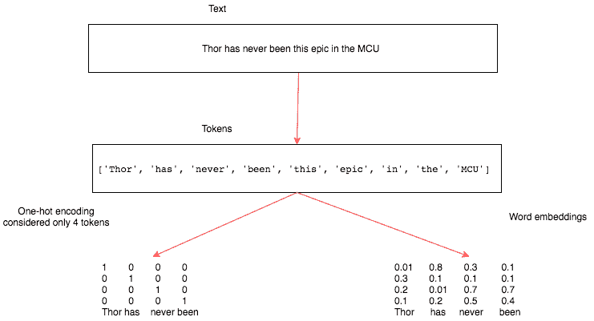
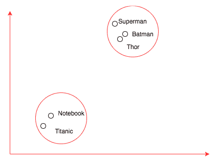
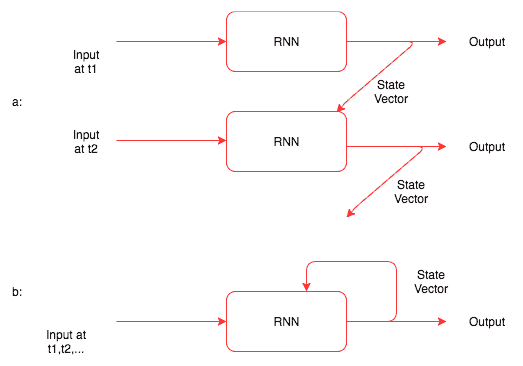
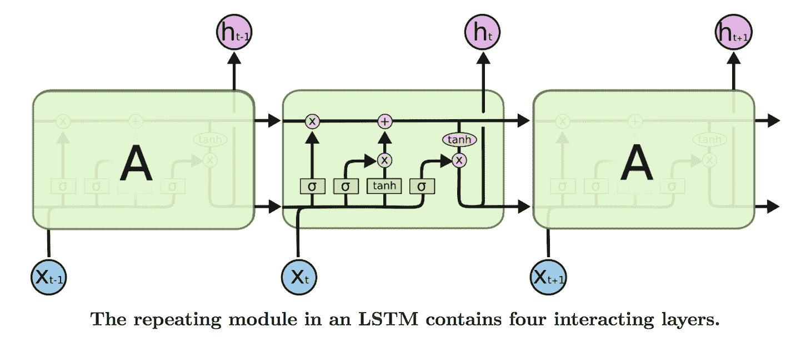

# 五、为深度学习使用序列数据和文本

在上一章中，我们介绍了如何使用**卷积神经网络**(**CNN**)处理空间数据，并构建了图像分类器。在本章中，我们将讨论以下主题:

*   对构建深度学习模型有用的文本数据的不同表示
*   了解**循环神经网络** ( **RNNs** )和 RNNs 的不同实现，例如**长短期记忆** ( **LSTM** )和**门控递归单元** ( **GRU** )，它们为大多数文本和序列数据的深度学习模型提供动力
*   对顺序数据使用一维卷积

可以使用 RNNs 构建的一些应用有:

*   **文档分类器**:识别推文或评论的情感，对新闻文章进行分类
*   **序列对序列学习**:用于语言翻译等任务，将英语转换成法语
*   **时间序列预测**:给定前几天商店的详细信息，预测商店的销售额

# 使用文本数据

文本是常用的顺序数据类型之一。文本数据可以被视为字符序列或单词序列。对于大多数问题来说，将文本视为单词序列是很常见的。深度学习序列模型，如 RNN 及其变体，能够从文本数据中学习重要的模式，这些模式可以解决以下领域的问题:

*   自然语言理解
*   文件分类
*   情感分类

这些顺序模型也是各种系统的重要组成部分，例如**问答** ( **QA** )系统。

尽管这些模型在构建这些应用程序时非常有用，但由于人类语言固有的复杂性，它们并不理解人类语言。这些顺序模型能够成功地找到有用的模式，然后用于执行不同的任务。将深度学习应用于文本是一个快速发展的领域，每个月都有大量新技术问世。我们将涵盖驱动大多数现代深度学习应用程序的基本组件。

深度学习模型和其他任何机器学习模型一样，不理解文本，所以我们需要将文本转换成数字表示。将文本转换成数字表示的过程称为**矢量化**，可以用不同的方式完成，如下所示:

*   将文本转换成单词，并将每个单词表示为一个向量
*   将文本转换为字符，并将每个字符表示为一个向量
*   创建 n 个单词，并用向量来表示它们

文本数据可以分解成这些表示形式中的一种。每个更小的文本单元被称为一个**记号**，将文本分解成记号的过程被称为**记号化**。Python 中有很多强大的库可以帮助我们进行标记化。一旦我们将文本数据转换成标记，我们就需要将每个标记映射到一个向量。一键编码和词嵌入是将标记映射到向量的两种最流行的方法。下图总结了将文本转换为矢量表示的步骤:



让我们更详细地看看记号化、 *n* -gram 表示和矢量化。

# 标记化

给定一个句子，将其拆分成字符或单词称为**标记化**。有些库，比如 spaCy，提供了复杂的令牌化解决方案。让我们使用简单的 Python 函数，如`split`和`list`，将文本转换成标记。

为了演示记号化是如何作用于字符和单词的，让我们来回顾一下电影《雷神 3：诸神的黄昏》。我们将使用以下文本:

这部电影的动作场面是一流的。雷神在 MCU 里从来没有这么史诗。他在这部电影中做了一些非常史诗般的表演，他肯定不会再被低估了。雷神在此释放，我喜欢。

# 将文本转换为字符

Python `list`函数获取一个字符串，并将其转换成一个单个字符的列表。这完成了将文本转换成字符的工作。下面的代码块显示了使用的代码和结果:

```
thor_review = "the action scenes were top notch in this movie. Thor has never been this epic in the MCU. He does some pretty epic sh*t in this movie and he is definitely not under-powered anymore. Thor in unleashed in this, I love that."

print(list(thor_review))

```

结果如下:

```

#Results
['t', 'h', 'e', ' ', 'a', 'c', 't', 'i', 'o', 'n', ' ', 's', 'c', 'e', 'n', 'e', 's', ' ', 'w', 'e', 'r', 'e', ' ', 't', 'o', 'p', ' ', 'n', 'o', 't', 'c', 'h', ' ', 'i', 'n', ' ', 't', 'h', 'i', 's', ' ', 'm', 'o', 'v', 'i', 'e', '.', ' ', 'T', 'h', 'o', 'r', ' ', 'h', 'a', 's', ' ', 'n', 'e', 'v', 'e', 'r', ' ', 'b', 'e', 'e', 'n', ' ', 't', 'h', 'i', 's', ' ', 'e', 'p', 'i', 'c', ' ', 'i', 'n', ' ', 't', 'h', 'e', ' ', 'M', 'C', 'U', '.', ' ', 'H', 'e', ' ', 'd', 'o', 'e', 's', ' ', 's', 'o', 'm', 'e', ' ', 'p', 'r', 'e', 't', 't', 'y', ' ', 'e', 'p', 'i', 'c', ' ', 's', 'h', '*', 't', ' ', 'i', 'n', ' ', 't', 'h', 'i', 's', ' ', 'm', 'o', 'v', 'i', 'e', ' ', 'a', 'n', 'd', ' ', 'h', 'e', ' ', 'i', 's', ' ', 'd', 'e', 'f', 'i', 'n', 'i', 't', 'e', 'l', 'y', ' ', 'n', 'o', 't', ' ', 'u', 'n', 'd', 'e', 'r', '-', 'p', 'o', 'w', 'e', 'r', 'e', 'd', ' ', 'a', 'n', 'y', 'm', 'o', 'r', 'e', '.', ' ', 'T', 'h', 'o', 'r', ' ', 'i', 'n', ' ', 'u', 'n', 'l', 'e', 'a', 's', 'h', 'e', 'd', ' ', 'i', 'n', ' ', 't', 'h', 'i', 's', ',', ' ', 'I', ' ', 'l', 'o', 'v', 'e', ' ', 't', 'h', 'a', 't', '.']
```

这个结果显示了我们简单的 Python 函数是如何将文本转换成标记的。

# 将文本转换为单词

我们将使用 Python string 对象中可用的`split`函数将文本分解成单词。`split`函数接受一个参数，根据这个参数它将文本分割成标记。对于我们的例子，我们将使用空格作为分隔符。下面的代码块演示了我们如何使用 Python `split`函数将文本转换成单词:

```
print(Thor_review.split())

#Results

['the', 'action', 'scenes', 'were', 'top', 'notch', 'in', 'this', 'movie.', 'Thor', 'has', 'never', 'been', 'this', 'epic', 'in', 'the', 'MCU.', 'He', 'does', 'some', 'pretty', 'epic', 'sh*t', 'in', 'this', 'movie', 'and', 'he', 'is', 'definitely', 'not', 'under-powered', 'anymore.', 'Thor', 'in', 'unleashed', 'in', 'this,', 'I', 'love', 'that.']
```

在前面的代码中，我们没有使用任何分隔符；默认情况下，`split`函数在空格处拆分。

# n 元语法表示

我们已经看到文本是如何被表示为字符和单词的。有时把两个、三个或更多的单词放在一起看是很有用的。 *N* -grams 是从给定文本中提取的单词组。在一个 *n* -gram 中， *n* 代表可以一起使用的单词数。让我们看一个二元模型( *n=2* )的例子。我们使用 Python `nltk`包为`thor_review`生成一个二元模型。以下代码块显示了二元模型的结果以及用于生成它的代码:

```
from nltk import ngrams

print(list(ngrams(thor_review.split(),2)))

#Results
[('the', 'action'), ('action', 'scenes'), ('scenes', 'were'), ('were', 'top'), ('top', 'notch'), ('notch', 'in'), ('in', 'this'), ('this', 'movie.'), ('movie.', 'Thor'), ('Thor', 'has'), ('has', 'never'), ('never', 'been'), ('been', 'this'), ('this', 'epic'), ('epic', 'in'), ('in', 'the'), ('the', 'MCU.'), ('MCU.', 'He'), ('He', 'does'), ('does', 'some'), ('some', 'pretty'), ('pretty', 'epic'), ('epic', 'sh*t'), ('sh*t', 'in'), ('in', 'this'), ('this', 'movie'), ('movie', 'and'), ('and', 'he'), ('he', 'is'), ('is', 'definitely'), ('definitely', 'not'), ('not', 'under-powered'), ('under-powered', 'anymore.'), ('anymore.', 'Thor'), ('Thor', 'in'), ('in', 'unleashed'), ('unleashed', 'in'), ('in', 'this,'), ('this,', 'I'), ('I', 'love'), ('love', 'that.')]
```

`ngrams`函数接受一个单词序列作为第一个参数，接受要分组的单词数作为第二个参数。下面的代码块显示了三元模型的外观，以及用于它的代码:

```
print(list(ngrams(thor_review.split(),3)))

#Results

[('the', 'action', 'scenes'), ('action', 'scenes', 'were'), ('scenes', 'were', 'top'), ('were', 'top', 'notch'), ('top', 'notch', 'in'), ('notch', 'in', 'this'), ('in', 'this', 'movie.'), ('this', 'movie.', 'Thor'), ('movie.', 'Thor', 'has'), ('Thor', 'has', 'never'), ('has', 'never', 'been'), ('never', 'been', 'this'), ('been', 'this', 'epic'), ('this', 'epic', 'in'), ('epic', 'in', 'the'), ('in', 'the', 'MCU.'), ('the', 'MCU.', 'He'), ('MCU.', 'He', 'does'), ('He', 'does', 'some'), ('does', 'some', 'pretty'), ('some', 'pretty', 'epic'), ('pretty', 'epic', 'sh*t'), ('epic', 'sh*t', 'in'), ('sh*t', 'in', 'this'), ('in', 'this', 'movie'), ('this', 'movie', 'and'), ('movie', 'and', 'he'), ('and', 'he', 'is'), ('he', 'is', 'definitely'), ('is', 'definitely', 'not'), ('definitely', 'not', 'under-powered'), ('not', 'under-powered', 'anymore.'), ('under-powered', 'anymore.', 'Thor'), ('anymore.', 'Thor', 'in'), ('Thor', 'in', 'unleashed'), ('in', 'unleashed', 'in'), ('unleashed', 'in', 'this,'), ('in', 'this,', 'I'), ('this,', 'I', 'love'), ('I', 'love', 'that.')]
```

前面代码中唯一改变的是函数的第二个参数*n*-值。

许多有监督的机器学习模型，例如朴素贝叶斯，使用 *n* -grams 来改善它们的特征空间。 *n* -grams 也用于拼写纠正和文本摘要任务。

用*n*gram 表示的一个挑战是，它失去了文本的顺序性。它通常用于浅层机器学习模型。这种技术很少用于深度学习，因为 RNN 和 Conv1D 等架构会自动学习这些表示。

# …向量化…

将生成的令牌映射到数字向量有两种流行的方法，称为**一键编码**和**词嵌入**。让我们通过编写一个简单的 Python 程序来理解如何将令牌转换成这些向量表示。我们还将讨论每种方法的各种利弊。

# 一键编码

在独热编码中，每个令牌由长度为 N 的向量表示，其中 *N* 是词汇表的大小。词汇表是文档中唯一单词的总数。让我们用一个简单的句子来观察每个记号是如何被表示为一个热编码向量的。下面是句子及其相关的标记表示:

医生说，一天一个苹果，医生远离我。

前一句的独热编码可以表示为如下的表格格式:

| 一；一个 | 100000000 |
| 苹果 | 010000000 |
| a | 001000000 |
| 天 | 000100000 |
| 保持 | 000010000 |
| 医生 | 000001000 |
| 离开 | 000000100 |
| 说 | 000000010 |
| 这 | 000000001 |

下表描述了令牌及其独热编码表示。向量长度是 9，因为句子中有 9 个唯一的单词。许多机器学习库简化了创建一次性编码变量的过程。为了更容易理解，我们将编写自己的实现，并且我们可以使用相同的实现来构建后面的示例所需的其他特性。下面的代码包含一个`Dictionary`类，该类包含创建唯一单词字典的功能，以及返回特定单词的一键编码向量的功能。让我们看一下代码，然后浏览一下每个功能:

```
class Dictionary(object):
    def __init__(self):
        self.word2idx = {}
        self.idx2word = []
        self.length = 0

    def add_word(self,word):
        if word not in self.idx2word:
            self.idx2word.append(word)
            self.word2idx[word] = self.length + 1
            self.length += 1
        return self.word2idx[word]

    def __len__(self):
        return len(self.idx2word)

    def onehot_encoded(self,word):
        vec = np.zeros(self.length)
        vec[self.word2idx[word]] = 1
        return vec

```

前面的代码提供了三个重要的功能:

*   初始化函数`__init__`创建一个`word2idx`字典，它将存储所有唯一的单词和索引。`idx2word`列表存储所有唯一的单词，而`length`变量包含我们文档中唯一单词的总数。
*   `add_word`函数获取一个单词并将其添加到`word2idx`和`idx2word`中，并增加词汇表的长度，前提是该单词是唯一的。
*   `onehot_encoded`函数获取一个单词，并返回一个长度为 N 的向量，除了单词的索引处，其他地方都是零。如果传递的字的索引是 2，那么索引 2 处的向量的值将是 1，所有剩余的值将是 0。

因为我们已经定义了我们的`Dictionary`类，所以让我们在我们的`thor_review`数据上使用它。下面的代码演示了如何构建`word2idx`以及如何调用我们的`onehot_encoded`函数:

```
dic = Dictionary()

for tok in thor_review.split():
    dic.add_word(tok)

print(dic.word2idx)
```

上述代码的输出如下:

```
# Results of word2idx

{'the': 1, 'action': 2, 'scenes': 3, 'were': 4, 'top': 5, 'notch': 6, 'in': 7, 'this': 8, 'movie.': 9, 'Thor': 10, 'has': 11, 'never': 12, 'been': 13, 'epic': 14, 'MCU.': 15, 'He': 16, 'does': 17, 'some': 18, 'pretty': 19, 'sh*t': 20, 'movie': 21, 'and': 22, 'he': 23, 'is': 24, 'definitely': 25, 'not': 26, 'under-powered': 27, 'anymore.': 28, 'unleashed': 29, 'this,': 30, 'I': 31, 'love': 32, 'that.': 33}

```

单词`were`的一键编码如下:

```
# One-hot representation of the word 'were'
dic.onehot_encoded('were')
array([ 0.,  0.,  0.,  0.,  1.,  0.,  0.,  0.,  0.,  0.,  0.,  0.,  0.,
        0.,  0.,  0.,  0.,  0.,  0.,  0.,  0.,  0.,  0.,  0.,  0.,  0.,
        0.,  0.,  0.,  0.,  0.,  0.,  0.])
```

独热表示的挑战之一是数据太稀疏，并且向量的大小随着词汇表中唯一单词数量的增加而快速增长，这被认为是一种限制，因此很少用于深度学习。

# 词嵌入

在深度学习算法解决的问题中，词嵌入是一种非常流行的表示文本数据的方式。词嵌入提供了用浮点数填充的单词的密集表示。向量的维数根据词汇量的大小而变化。通常使用尺寸大小为 50、100、256、300 以及有时 1000 的字嵌入。维度大小是一个超参数，我们需要在训练阶段使用它。

如果我们试图用一键表示来表示 20，000 个词汇，那么我们将得到 20，000 x 20，000 个数字，其中大部分为零。相同的词汇表可以在词嵌入中表示为 20，000×维度大小，其中维度大小可以是 10、50、300 等等。

创建词嵌入的一种方法是从每个包含随机数的标记的密集向量开始，然后训练一个模型，如文档分类器或情感分类器。表示记号的浮点数将以某种方式进行调整，使得语义上更接近的单词将具有相似的表示。为了理解它，让我们看下图，其中我们在五部电影的二维图上绘制了词嵌入向量:



上图显示了如何调整密集向量，以使语义相似的单词具有较小的距离。由于电影片名如**超人**、**雷神**、**蝙蝠侠**都是根据漫画改编的动作片，因此这类文字的嵌入更为接近，而电影**泰坦尼克号**的嵌入则远离动作片，更接近电影片名**笔记本**，因为它们是爱情片。

当数据太少时，学习词嵌入可能不可行，在这种情况下，我们可以使用由其他机器学习算法训练的词嵌入。从另一个任务生成的嵌入称为**预训练的**字嵌入。我们将学习如何构建我们自己的词嵌入和使用预训练的词嵌入。

# 通过建立情感分类器训练词嵌入

在上一节中，我们简要地了解了没有实现的词嵌入。在本节中，我们将下载一个名为`IMDB`的数据集，其中包含评论，并构建一个情感分类器来计算评论的情感是积极、消极还是未知。在构建过程中，我们还会针对`IMDB`数据集中出现的单词进行词嵌入训练。我们将使用一个名为`torchtext`的库，它使许多过程变得更加容易，比如下载、文本矢量化和批处理。训练情感分类器将包括以下步骤:

1.  下载 IMDB 数据并执行文本标记化
2.  积累词汇
3.  生成成批的矢量
4.  创建具有嵌入的网络模型
5.  训练模型

# 下载 IMDB 数据并执行文本标记化

对于与计算机视觉相关的应用，我们使用了`torchvision`库，它为我们提供了许多实用函数，有助于构建计算机视觉应用。同样，PyTorch 中有一个名为`torchtext`的库，它是 PyTorch 的一部分，通过为文本提供不同的数据加载器和抽象，它可以与 py torch 一起工作，并简化许多与**自然语言处理** ( **NLP** )相关的活动。在撰写本文时，`torchtext`没有附带 PyTorch 安装，需要单独安装。您可以在机器的命令行中运行以下代码来安装`torchtext`:

```
pip install torchtext
```

一旦安装完毕，我们就可以使用它了。Torchtext 提供了两个重要的模块，叫做`torchtext.data`和`torchtext.datasets`。

我们可以从以下链接下载`IMDB Movies`数据集:【https://www.kaggle.com/orgesleka/imdbmovies[T4](https://www.kaggle.com/orgesleka/imdbmovies)

# torchtext.data

`torchtext.data`实例定义了一个名为`Field`的类，它帮助我们定义如何读取和标记数据。让我们看看下面的例子，我们将用它来准备我们的`IMDB`数据集:

```
from torchtext import data
TEXT = data.Field(lower=True, batch_first=True,fix_length=20)
LABEL = data.Field(sequential=False)
```

在前面的代码中，我们定义了两个`Field`对象，一个用于实际文本，另一个用于标签数据。对于实际的文本，我们期望`torchtext`将所有文本小写，标记文本，并将其修剪到最大长度`20`。如果我们为生产环境构建应用程序，我们可以将长度固定为一个更大的数字。但是，对于玩具的例子，它工作得很好。`Field`构造函数还接受另一个名为**的参数，这个参数默认使用`str.split`函数。我们还可以指定 spaCy 作为参数，或者任何其他标记符。对于我们的例子，我们将坚持使用`str.split`。**

# torchtext.datasets

`torchtext.datasets`实例提供了使用不同数据集的包装器，如 IMDB、TREC(问题分类)、语言建模(WikiText-2)和其他一些数据集。我们将使用`torch.datasets`下载`IMDB`数据集，并将其分成`train`和`test`数据集。下面的代码可以做到这一点，当您第一次运行它时，它可能需要几分钟时间(取决于您的宽带连接),因为它会从互联网下载`IMDB`数据集:

```
train, test = datasets.IMDB.splits(TEXT, LABEL)
```

前面的数据集的`IMDB`类抽象出了下载、标记和将数据库分割成`train`和`test`数据集所涉及的所有复杂性。`train.fields`包含一个字典，其中`TEXT`是键，值是`LABEL`。让我们看看`train.fields`和`train`的每个元素包含:

```
print('train.fields', train.fields)

#Results 
train.fields {'text': <torchtext.data.field.Field object at 0x1129db160>, 'label': <torchtext.data.field.Field object at 0x1129db1d0>}

print(vars(train[0]))

#Results 

vars(train[0]) {'text': ['for', 'a', 'movie', 'that', 'gets', 'no', 'respect', 'there', 'sure', 'are', 'a', 'lot', 'of', 'memorable', 'quotes', 'listed', 'for', 'this', 'gem.', 'imagine', 'a', 'movie', 'where', 'joe', 'piscopo', 'is', 'actually', 'funny!', 'maureen', 'stapleton', 'is', 'a', 'scene', 'stealer.', 'the', 'moroni', 'character', 'is', 'an', 'absolute', 'scream.', 'watch', 'for', 'alan', '"the', 'skipper"', 'hale', 'jr.', 'as', 'a', 'police', 'sgt.'], 'label': 'pos'}
```

从这些结果中我们可以看到，单个元素包含一个字段`text`，以及代表`text`的所有标记，还有一个包含文本标签的`label`字段。现在我们已经为批处理准备好了`IMDB`数据集。

# 构建词汇

当我们为`thor_review`创建一次性编码时，我们创建了一个`word2idx`字典，它被称为词汇表，因为它包含了文档中唯一单词的所有细节。`torchtext`实例让我们更容易做到这一点。一旦加载了数据，我们就可以调用`build_vocab`并传递必要的参数来为数据构建词汇表。以下代码显示了词汇表是如何构建的:

```
TEXT.build_vocab(train, vectors=GloVe(name='6B', dim=300),max_size=10000,min_freq=10)
LABEL.build_vocab(train)
```

在前面的代码中，我们传入了需要在其上构建词汇表的`train`对象，我们还要求它使用预训练的维度嵌入`300`来初始化向量。当我们使用预先训练的权重训练情感分类器时，`build_vocab`对象只是下载并创建将在以后使用的维度。`max_size`实例限制词汇表中的单词数量，`min_freq`删除任何没有出现超过十次的单词，其中`10`是可配置的。

一旦构建了词汇表，我们就可以获得不同的值，比如频率、单词索引和每个单词的向量表示。下面的代码演示了如何访问这些值:

```
print(TEXT.vocab.freqs)

# A sample result 
Counter({"i'm": 4174,
         'not': 28597,
         'tired': 328,
         'to': 133967,
         'say': 4392,
         'this': 69714,
         'is': 104171,
         'one': 22480,
         'of': 144462,
         'the': 322198,
```

以下代码演示了如何访问结果:

```

print(TEXT.vocab.vectors)

#Results displaying the 300 dimension vector for each word.
0.0000 0.0000 0.0000 ... 0.0000 0.0000 0.0000
0.0000 0.0000 0.0000 ... 0.0000 0.0000 0.0000
0.0466 0.2132 -0.0074 ... 0.0091 -0.2099 0.0539
      ... ⋱ ... 
0.0000 0.0000 0.0000 ... 0.0000 0.0000 0.0000
0.7724 -0.1800 0.2072 ... 0.6736 0.2263 -0.2919
0.0000 0.0000 0.0000 ... 0.0000 0.0000 0.0000
[torch.FloatTensor of size 10002x300]

print(TEXT.vocab.stoi)

# Sample results
defaultdict(<function torchtext.vocab._default_unk_index>,
            {'<unk>': 0,
             '<pad>': 1,
             'the': 2,
             'a': 3,
             'and': 4,
             'of': 5,
             'to': 6,
             'is': 7,
             'in': 8,
             'i': 9,
             'this': 10,
             'that': 11,
             'it': 12,
```

`stoi`提供了对包含单词及其索引的字典的访问。

# 生成批量矢量

Torchtext 提供了`BucketIterator`，它有助于对所有文本进行批处理，并用单词的索引号替换单词。`BucketIterator`实例带有许多有用的参数，如`batch_size`、`device` (GPU 或 CPU)和`shuffle`(数据是否必须被打乱)。下面的代码演示了如何创建迭代器来为`train`和`test`数据集生成批处理:

```
train_iter, test_iter = data.BucketIterator.splits((train, test), batch_size=128, device=-1,shuffle=True)
#device = -1 represents cpu , if u want gpu leave it to None.
```

前面的代码为`train`和`test`数据集提供了一个`BucketIterator`对象。下面的代码将展示如何创建一个`batch`并显示`batch`的结果:

```
batch = next(iter(train_iter))
batch.text

#Results
Variable containing:
 5128 427 19 ... 1688 0 542
   58 2 0 ... 2 0 1352
    0 9 14 ... 2676 96 9
       ... ⋱ ... 
  129 1181 648 ... 45 0 2
 6484 0 627 ... 381 5 2
  748 0 5052 ... 18 6660 9827
[torch.LongTensor of size 128x20]

batch.label

#Results
Variable containing:
 2
 1
 2
 1
 2
 1
 1
 1
[torch.LongTensor of size 128]
```

从前面代码块的结果中，我们可以看到文本数据是如何转换成大小为(`batch_size` * `fix_len`)的矩阵的，也就是(`128x20`)。

# 使用嵌入创建网络模型

我们之前简要讨论了词嵌入。在本节中，我们创建词嵌入作为我们网络架构的一部分，并训练整个模型来预测每个评论的情绪。在培训结束时，我们将拥有一个情感分类器模型，以及针对`IMDB`数据集的词嵌入。下面的代码演示了如何创建一个网络架构来使用词嵌入来预测情绪:

```
class EmbNet(nn.Module):
    def __init__(self,emb_size,hidden_size1,hidden_size2=400):
        super().__init__()
        self.embedding = nn.Embedding(emb_size,hidden_size1)
        self.fc = nn.Linear(hidden_size2,3)

    def forward(self,x):
        embeds = self.embedding(x).view(x.size(0),-1)
        out = self.fc(embeds)
        return F.log_softmax(out,dim=-1)
```

在前面的代码中，`EmbNet`创建了用于情感分类的模型。在`__init__`函数中，我们初始化了一个`nn.Embedding`类的对象，它有两个参数，即词汇表的大小和我们希望为每个单词创建的维度。因为我们已经限制了唯一单词的数量，所以词汇表的大小将是 10，000，我们可以从一个小的嵌入大小`10`开始。为了快速运行程序，较小的嵌入大小是有用的，但是当您试图为生产系统构建应用程序时，请使用较大的嵌入大小。我们还有一个线性层，将词嵌入映射到类别(正面、负面或未知)。

`forward`功能决定如何处理输入数据。对于 32 个批量和最大长度为 20 个单词的句子，我们将输入 32 x 20 的形状。第一个嵌入层充当查找表，用相应的嵌入向量替换每个单词。对于 10 的嵌入维数，当每个单词被其对应的嵌入替换时，输出变成 32 x 20 x 10。`view()`函数将展平来自嵌入层的结果。传递给`view`的第一个参数将保持该维度不变。在我们的例子中，我们不想合并来自不同批次的数据，所以我们保留第一维，并展平张量中的其余值。应用`view`功能后，张量形状变为 32 x 200。密集层将扁平化嵌入映射到类别的数量。一旦定义了网络，我们就可以像往常一样训练网络。

请记住，在这个网络中，我们失去了文本的连续性，我们只是把它们当作一个单词包。

# 训练模型

训练模型与我们看到的构建图像分类器非常相似，因此我们将使用相同的函数。我们通过模型传递批量数据，计算输出和损失，然后优化模型权重，包括嵌入权重。下面的代码可以做到这一点:

```
def fit(epoch,model,data_loader,phase='training',volatile=False):
    if phase == 'training':
        model.train()
    if phase == 'validation':
        model.eval()
        volatile=True
    running_loss = 0.0
    running_correct = 0
    for batch_idx , batch in enumerate(data_loader):
        text , target = batch.text , batch.label
        if is_cuda:
            text,target = text.cuda(),target.cuda()

        if phase == 'training':
            optimizer.zero_grad()
        output = model(text)
        loss = F.nll_loss(output,target)

        running_loss += F.nll_loss(output,target,size_average=False).data[0]
        preds = output.data.max(dim=1,keepdim=True)[1]
        running_correct += preds.eq(target.data.view_as(preds)).cpu().sum()
        if phase == 'training':
            loss.backward()
            optimizer.step()

    loss = running_loss/len(data_loader.dataset)
    accuracy = 100\. * running_correct/len(data_loader.dataset)

    print(f'{phase} loss is {loss:{5}.{2}} and {phase} accuracy is {running_correct}/{len(data_loader.dataset)}{accuracy:{10}.{4}}')
    return loss,accuracy

train_losses , train_accuracy = [],[]
val_losses , val_accuracy = [],[]

train_iter.repeat = False
test_iter.repeat = False

for epoch in range(1,10):

    epoch_loss, epoch_accuracy = fit(epoch,model,train_iter,phase='training')
    val_epoch_loss , val_epoch_accuracy = fit(epoch,model,test_iter,phase='validation')
    train_losses.append(epoch_loss)
    train_accuracy.append(epoch_accuracy)
    val_losses.append(val_epoch_loss)
    val_accuracy.append(val_epoch_accuracy)
```

在前面的代码中，我们通过传递为批处理数据而创建的`BucketIterator`对象来调用`fit`方法。默认情况下，迭代器不会停止生成批处理，所以我们必须将`BucketIterator`对象的`repeat`变量设置为`False`。如果我们不将`repeat`变量设置为`False`，那么`fit`函数将无限期运行。训练该模型大约 10 个时期给出了大约 70%的验证准确度。

# 使用预训练的词嵌入

当我们在特定领域工作时，如医学和制造业，预先训练的词嵌入将是有用的，在这些领域中，我们有大量的数据来训练嵌入。当我们只有很少的数据，无法有意义地训练嵌入时，我们可以使用嵌入，这是在不同的数据集上训练的，如维基百科，谷歌新闻和推特推文。许多团队使用不同的方法训练开源词嵌入。在这一节中，我们将探索`torchtext`如何使使用不同的词嵌入变得更容易，以及如何在我们的 PyTorch 模型中使用它们。它类似于我们在计算机视觉应用中使用的迁移学习。通常，使用预训练嵌入会涉及以下步骤:

*   下载嵌入
*   在模型中加载嵌入
*   冻结嵌入层权重

让我们详细探讨一下每一步是如何实现的。

# 下载嵌入

`torchtext`库抽象出了下载嵌入并将它们映射到正确单词的大量复杂性。Torchtext 在`vocab`模块中提供了三个类，即`GloVe`、`FastText`、`CharNGram`，简化了下载嵌入的过程，并将它们映射到我们的词汇表。这些类中的每一个都提供了在不同数据集上训练的不同嵌入，并使用不同的技术。让我们看看提供的一些不同的嵌入:

*   `charngram.100d`
*   `fasttext.en.300d`
*   `fasttext.simple.300d`
*   `glove.42B.300d`
*   `glove.840B.300d`
*   `glove.twitter.27B.25d`
*   `glove.twitter.27B.50d`
*   `glove.twitter.27B.100d`
*   `glove.twitter.27B.200d`
*   ``glove.6B.50d``
*   `glove.6B.100d`
*   `glove.6B.200d`
*   `glove.6B.300d`

`Field`对象的`build_vocab`方法接受嵌入的一个参数。下面的代码解释了我们如何下载嵌入:

```
from torchtext.vocab import GloVe
TEXT.build_vocab(train, vectors=GloVe(name='6B', dim=300),max_size=10000,min_freq=10)
LABEL.build_vocab(train,)
```

参数向量的值表示要使用什么嵌入类。`name`和`dim`参数决定了可以使用哪些嵌入。我们可以很容易地从`vocab`对象中访问嵌入。下面的代码演示了它，并展示了结果的外观:

```
TEXT.vocab.vectors

#Output
0.0000 0.0000 0.0000 ... 0.0000 0.0000 0.0000
 0.0000 0.0000 0.0000 ... 0.0000 0.0000 0.0000
 0.0466 0.2132 -0.0074 ... 0.0091 -0.2099 0.0539
          ... ⋱ ... 
 0.0000 0.0000 0.0000 ... 0.0000 0.0000 0.0000
 0.7724 -0.1800 0.2072 ... 0.6736 0.2263 -0.2919
 0.0000 0.0000 0.0000 ... 0.0000 0.0000 0.0000
[torch.FloatTensor of size 10002x300]
```

现在我们已经下载并映射了嵌入到我们的词汇表中。让我们了解如何在 PyTorch 模型中使用它们。

# 在模型中加载嵌入

`vectors`变量返回包含预训练嵌入的形状为`vocab_size x dimensions`的 torch 张量。我们必须存储嵌入到我们的嵌入层的权重中。我们可以通过访问嵌入层的权重来分配嵌入的权重，如下面的代码所示。

```
model.embedding.weight.data = TEXT.vocab.vectors
```

`model`代表我们网络的对象，`embedding`代表嵌入层。当我们使用新维度的嵌入层时，嵌入层之后的线性层的输入会有一个小的变化。下面的代码具有新的架构，它类似于之前我们用来训练嵌入的架构:

```
class EmbNet(nn.Module):
    def __init__(self,emb_size,hidden_size1,hidden_size2=400):
        super().__init__()
        self.embedding = nn.Embedding(emb_size,hidden_size1)
        self.fc1 = nn.Linear(hidden_size2,3)

    def forward(self,x):
        embeds = self.embedding(x).view(x.size(0),-1)
        out = self.fc1(embeds)
        return F.log_softmax(out,dim=-1)

model = EmbNet(len(TEXT.vocab.stoi),300,12000)
```

一旦嵌入被加载，我们必须确保，在训练期间，我们不改变嵌入权重。让我们讨论如何实现这一点。

# 冻结嵌入层权重

告诉 PyTorch 不要更改嵌入层的权重是一个两步过程:

1.  将`requires_grad`属性设置为`False`，这指示 PyTorch 对于这些权重不需要渐变。
2.  删除向优化器传递嵌入层参数。如果没有完成这一步，那么优化器将抛出一个错误，因为它期望所有的参数都有梯度。

以下代码演示了冻结嵌入层权重并指示优化器不要使用这些参数是多么容易:

```
model.embedding.weight.requires_grad = False
optimizer = optim.SGD([ param for param in model.parameters() if param.requires_grad == True],lr=0.001)
```

我们通常将所有模型参数传递给优化器，但是在前面的代码中，我们传递的参数的`requires_grad`为`True`。

我们可以使用这种精确的代码来训练模型，并且应该达到类似的精度。所有这些模型架构都未能利用文本的顺序性质。在下一节中，我们将探讨两种流行的技术，即 RNN 和 Conv1D，它们利用了数据的顺序性。

# 循环神经网络

rnn 是最强大的模型之一，它使我们能够进行分类、对序列数据进行标记、生成文本序列(例如使用预测下一个单词的*快捷键* *键盘*应用程序)，以及将一个序列转换为另一个序列，例如将一种语言从法语翻译为英语。大多数模型结构，如前馈神经网络，没有利用数据的顺序性质。例如，我们需要数据来表示向量中每个示例的特征，比如表示一个句子、段落或文档的所有标记。前馈网络被设计成只查看所有特征一次，并将它们映射到输出。让我们来看一个文本例子，它展示了为什么顺序或序列性质对文本很重要。*我清洗了我的车*和*我清洗了我的车*是两个相同词组的英语句子，但是只有当我们考虑单词的顺序时，它们才表示不同的意思。

人类通过从左到右阅读单词来理解文本数据，并建立一个强大的模型，该模型可以理解文本中所说的所有不同内容。RNN 的工作方式略有相似，一次看文本中的一个单词。RNN 也是一个神经网络，其中有一个特殊的层，它循环数据，而不是一次处理所有数据。由于 rnn 可以按顺序处理数据，我们可以使用不同长度的向量，并生成不同长度的输出。下图提供了一些不同的表示:


图片来源:http://karpathy.github.io/2015/05/21/rnn-effectiveness/

上一张图片来自 RNN([http://karpathy.github.io/2015/05/21/rnn-effectiveness](http://karpathy.github.io/2015/05/21/rnn-effectiveness))上的一个著名博客，作者安德烈·卡帕西(Andrej Karpathy)在博客中讲述了如何使用 Python 从头构建一个 RNN，并将其用作序列生成器。

# 用一个例子理解 RNN 是如何工作的

让我们假设我们已经建立了一个 RNN 模型，并尝试理解它提供了什么功能。一旦我们理解了 RNN 做什么，那么让我们来探索 RNN 内部发生了什么。

让我们把托尔的评论看作是对 RNN 模型的输入。我们正在看的示例文本是*这部电影中的动作场面是一流的....*。我们首先将第一个单词**传递给我们的模型；该模型生成两个不同的东西，一个**状态向量**和一个**输出**向量。当模型处理评论中的下一个单词时，状态向量被传递给模型，并生成新的状态向量。我们只考虑在最后一个序列中生成的模型的**输出**。下图对此进行了总结:**

**

上图演示了以下内容:

*   RNN 是如何展开它和图像的
*   状态如何递归地传递给同一个模型

到现在为止，你对 RNN 做什么已经有所了解，但还不知道它是如何运作的。在我们深入了解它的工作原理之前，让我们先来看一个代码片段，它更详细地展示了我们所学到的东西。我们仍将把 RNN 视为一个黑盒子:

```
rnn = RNN(input_size, hidden_size,output_size)
for i in range(len(Thor_review):
        output, hidden = rnn(thor_review[i], hidden)
```

在前面的代码中，`hidden`变量代表状态向量，有时称为**隐藏状态**。到现在为止，我们应该知道如何使用 RNN 了。现在，让我们看看实现 RNN 的代码，了解 RNN 内部发生了什么。下面的代码包含了`RNN`类:

```
import torch.nn as nn
from torch.autograd import Variable

class RNN(nn.Module):
    def __init__(self, input_size, hidden_size, output_size):
        super(RNN, self).__init__()
        self.hidden_size = hidden_size
        self.i2h = nn.Linear(input_size + hidden_size, hidden_size)
        self.i2o = nn.Linear(input_size + hidden_size, output_size)
        self.softmax = nn.LogSoftmax(dim=1)

    def forward(self, input, hidden):
        combined = torch.cat((input, hidden), 1)
        hidden = self.i2h(combined)
        output = self.i2o(combined)
        output = self.softmax(output)
        return output, hidden

    def initHidden(self):
        return Variable(torch.zeros(1, self.hidden_size))
```

除了前面代码中的单词`RNN`,其他的听起来都和我们在前面章节中使用的非常相似，因为 PyTorch 隐藏了大量复杂的反向传播。让我们通过`init`函数和`forward`函数来理解发生了什么。

`__init__`函数初始化两个线性层，一个用于计算输出，另一个用于计算状态或隐藏向量。

`forward`函数结合了`input`向量和`hidden`向量，并通过两个线性层，生成一个输出向量和一个隐藏状态。对于`output`层，我们应用了一个`log_softmax`函数。

`initHidden`函数有助于为第一次调用 RNN 创建没有状态的隐藏向量。让我们直观地看看下图中的`RNN`类做了什么:


上图显示了 RNN 的工作原理。

当你第一次遇到 RNN 的概念时，有时很难理解，所以我强烈推荐以下链接中提供的一些令人惊叹的博客:【http://karpathy.github.io/2015/05/21/rnn-effectiveness/
和[http://colah.github.io/posts/2015-08-Understanding-LSTMs/.](http://colah.github.io/posts/2015-08-Understanding-LSTMs/)

在下一节中，我们将学习如何使用 RNN 的一个变种 **LSTM** 在`IMDB`数据集上构建一个情感分类器。**  **# LSTM

RNN 在构建真实世界的应用程序中非常流行，如语言翻译、文本分类和许多更多的顺序问题，但在现实中，我们很少使用 RNN 的普通版本，正如我们在上一节中看到的那样。RNN 的普通版本在处理大型序列时存在消失梯度和梯度爆炸等问题。在大多数现实世界的问题中，使用 RNN 的变体，如 LSTM 或 GRU，它们解决了普通 RNN 的局限性，并且还具有更好地处理序列数据的能力。我们将试图理解在 LSTM 发生的事情，并建立一个基于 LSTM 的网络来解决`IMDB`数据集上的文本分类问题。

# 长期依赖

理论上，rnn 应该从历史数据中学习所有需要的相关性，以构建接下来发生的事情的上下文。比方说，我们正试图预测句子*中的最后一个单词:云在天上*。RNN 将能够预测它，因为信息(云)就在后面几个字。让我们来看另一个长段落，其中的依赖关系不需要那么紧密，我们希望预测其中的最后一个单词。这个句子看起来像*我出生在金奈，泰米尔纳德邦的一个城市。我和印度不同邦的学校教育...*。实际上，香草版本的 RNN 发现很难记住在序列的早期发生的上下文。LSTMs 和 RNN 的其他不同变体通过在 LSTM 内部添加不同的神经网络来解决这个问题，这些神经网络随后决定可以记住多少或哪些数据。

# LSTM 网络公司

LSTMs 是一种特殊的 RNN，能够学习长期依赖性。它们于 1997 年推出，并在最近几年随着可用数据和硬件的进步而流行起来。它们在各种各样的问题上表现得非常好，并且被广泛使用。

LSTMs 的设计是为了避免长期的依赖性问题，因为 LSTMs 的设计可以自然地长时间记忆信息。在 RNNs 中，我们看到它们如何在序列的每个元素上重复自己。在标准 RNNs 中，重复模块将具有像单个线性层一样的简单结构。

下图显示了一个简单的 RNN 是如何重复的:


在 LSTM 内部，我们没有使用简单的线性层，而是在 LSTM 内部使用更小的网络来完成独立的工作。下图展示了 LSTM 内部的情况:



图片来源:http://colah.github.io/posts/2015-08-Understanding-LSTMs/

上图第二个方框中的每个小矩形(黄色)方框表示 PyTorch 图层，圆圈表示元素矩阵或矢量加法，合并线表示两个矢量正在连接。好的一面是，我们不需要手动实现所有这些。大多数现代深度学习框架提供了一个抽象，它将处理 LSTM 内部发生的事情。PyTorch 提供了对`nn.LSTM`层中所有功能的抽象，我们可以像使用其他层一样使用它。LSTM 中最重要的事情是通过所有迭代的单元状态，在上图中由穿过单元的水平线表示。LSTM 内部的多个网络控制着细胞状态间的信息传递。在 LSTM(一个由符号 **σ** 代表的小网络)中，第一步是决定哪些信息将从细胞状态中被丢弃。这个网络被称为**遗忘门**，并有一个 sigmoid 作为激活函数，它为单元状态中的每个元素输出 0 和 1 之间的值。网络(PyTorch 层)使用以下公式表示:


来自网络的值决定哪些值将被保存在单元状态中，哪些值将被丢弃。下一步是决定我们将向单元状态添加什么信息。这有两个部分:一个 sigmoid 层，称为**输入门**，它决定更新什么值；和 tanh 层，它创建要添加到单元状态的新值。数学表示看起来像这样:


下一步，我们将输入 gate 和 tanh 产生的两个值合并。现在，我们可以更新单元状态，通过在遗忘门和如下公式所示的*I*[t]和 C [t] ，的乘积之和之间进行逐元素乘法:


最后，我们需要决定输出，这将是单元状态的过滤版本。有不同版本的 LSTM 可用，其中大多数工作原理相似。作为开发人员或数据科学家，我们很少需要担心 LSTM 内部发生的事情。如果你想了解更多，可以浏览下面的博客链接，它们以非常直观的方式涵盖了很多理论。

看看克里斯多佛·奥拉关于 LSTM([http://colah.github.io/posts/2015-08-Understanding-LSTMs](http://colah.github.io/posts/2015-08-Understanding-LSTMs))的令人惊叹的博客，以及布兰登·罗尔([https://brohrer.github.io/how_rnns_lstm_work.html](https://brohrer.github.io/how_rnns_lstm_work.html))的另一个博客，他在那里用一段很棒的视频解释了 LSTM。

既然我们了解了 LSTM，让我们实现一个 PyTorch 网络，我们可以用它来建立一个情感分类器。像往常一样，我们将遵循以下步骤来创建分类器:

1.  准备数据
2.  创建批处理
3.  创建网络
4.  训练模型

# 准备数据

我们使用相同的 torchtext 来下载、标记和构建`IMDB`数据集的词汇。当创建`Field`对象时，我们将`batch_first`参数留在`False`。RNN 网络期望数据以`Sequence_length`、`batch_size`和特征的形式出现。以下用于准备数据集:

```
TEXT = data.Field(lower=True,fix_length=200,batch_first=False)
LABEL = data.Field(sequential=False,)
train, test = IMDB.splits(TEXT, LABEL)
TEXT.build_vocab(train, vectors=GloVe(name='6B', dim=300),max_size=10000,min_freq=10)
LABEL.build_vocab(train,)
```

# 创建批次

我们使用 torchtext `BucketIterator`来创建批次，批次的大小将是序列长度和批次。对于我们的例子，大小将是[ `200`，`32` ]，其中 *200* 是序列长度， *32* 是批量大小。

以下是用于批处理的代码:

```
train_iter, test_iter = data.BucketIterator.splits((train, test), batch_size=32, device=-1)
train_iter.repeat = False
test_iter.repeat = False
```

# 创建网络

让我们看一下代码，然后浏览一下代码。您可能会惊讶于代码看起来是如此的相似:

```
class IMDBRnn(nn.Module):

    def __init__(self,vocab,hidden_size,n_cat,bs=1,nl=2):
        super().__init__()
        self.hidden_size = hidden_size
        self.bs = bs
        self.nl = nl
        self.e = nn.Embedding(n_vocab,hidden_size)
        self.rnn = nn.LSTM(hidden_size,hidden_size,nl)
        self.fc2 = nn.Linear(hidden_size,n_cat)
        self.softmax = nn.LogSoftmax(dim=-1)

    def forward(self,inp):
        bs = inp.size()[1]
        if bs != self.bs:
            self.bs = bs
        e_out = self.e(inp)
        h0 = c0 = Variable(e_out.data.new(*(self.nl,self.bs,self.hidden_size)).zero_())
        rnn_o,_ = self.rnn(e_out,(h0,c0)) 
        rnn_o = rnn_o[-1]
        fc = F.dropout(self.fc2(rnn_o),p=0.8)
        return self.softmax(fc)
```

`init`方法创建一个词汇表和`hidden_size`大小的嵌入层。它还创建了一个 LSTM 和一个线性层。最后一层是`LogSoftmax`层，用于将线性层的结果转换成概率。

在`forward`函数中，我们传递大小为[ `200`，`32` ]的输入数据，该数据通过嵌入层，并且该批中的每个标记都被嵌入所替换，大小变为[200，32，100]，其中 *100* 是嵌入维度。LSTM 层采用嵌入层的输出以及两个隐藏变量。隐藏变量应该与嵌入输出的类型相同，并且它们的大小应该为[ `num_layers`、`batch_size`、`hidden_size` ]。LSTM 按顺序处理数据，并生成形状[ `Sequence_length`、`batch_size`、`hidden_size` ]的输出，其中每个序列索引代表该序列的输出。在这种情况下，我们只需获取最后一个序列的输出，其形状为[ `batch_size`，`hidden_dim` ]，并将其传递到一个线性层，以将其映射到输出类别。由于模型往往过拟合，添加一个辍学层。你可以玩辍学概率。

# 训练模型

一旦创建了网络，我们就可以使用与前面示例中相同的代码来训练模型。下面是为模型定型的代码:

```
model = IMDBRnn(n_vocab,n_hidden,3,bs=32)
model = model.cuda()

optimizer = optim.Adam(model.parameters(),lr=1e-3)

def fit(epoch,model,data_loader,phase='training',volatile=False):
    if phase == 'training':
        model.train()
    if phase == 'validation':
        model.eval()
        volatile=True
    running_loss = 0.0
    running_correct = 0
    for batch_idx , batch in enumerate(data_loader):
        text , target = batch.text , batch.label
        if is_cuda:
            text,target = text.cuda(),target.cuda()

        if phase == 'training':
            optimizer.zero_grad()
        output = model(text)
        loss = F.nll_loss(output,target)

        running_loss += F.nll_loss(output,target,size_average=False).data[0]
        preds = output.data.max(dim=1,keepdim=True)[1]
        running_correct += preds.eq(target.data.view_as(preds)).cpu().sum()
        if phase == 'training':
            loss.backward()
            optimizer.step()

    loss = running_loss/len(data_loader.dataset)
    accuracy = 100\. * running_correct/len(data_loader.dataset)

    print(f'{phase} loss is {loss:{5}.{2}} and {phase} accuracy is {running_correct}/{len(data_loader.dataset)}{accuracy:{10}.{4}}')
    return loss,accuracy

train_losses , train_accuracy = [],[]
val_losses , val_accuracy = [],[]

for epoch in range(1,5):

    epoch_loss, epoch_accuracy = fit(epoch,model,train_iter,phase='training')
    val_epoch_loss , val_epoch_accuracy = fit(epoch,model,test_iter,phase='validation')
    train_losses.append(epoch_loss)
    train_accuracy.append(epoch_accuracy)
    val_losses.append(val_epoch_loss)
    val_accuracy.append(val_epoch_accuracy)

```

以下是培训模型的结果:

```
#Results

training loss is   0.7 and training accuracy is 12564/25000     50.26
validation loss is   0.7 and validation accuracy is 12500/25000      50.0
training loss is  0.66 and training accuracy is 14931/25000     59.72
validation loss is  0.57 and validation accuracy is 17766/25000     71.06
training loss is  0.43 and training accuracy is 20229/25000     80.92
validation loss is   0.4 and validation accuracy is 20446/25000     81.78
training loss is   0.3 and training accuracy is 22026/25000      88.1
validation loss is  0.37 and validation accuracy is 21009/25000     84.04
```

训练四个时期的模型给出了 84%的准确度。随着损失开始增加，更多时期的训练导致模型过度拟合。我们可以尝试一些我们尝试过的技术，例如减少隐藏维度，增加序列长度，以及用较小的学习率进行训练，以进一步提高准确性。

我们还将探索如何使用一维卷积对序列数据进行训练。

# 序列数据上的卷积网络

我们学习了 CNN 如何通过从图像中学习特征来解决计算机视觉中的问题。在图像中，CNN 通过在高度和宽度上卷积来工作。同样，时间可以被视为卷积特征。一维卷积有时比 RNNs 性能更好，并且计算成本更低。在过去的几年里，像脸书这样的公司已经在音频生成和机器翻译方面取得了成功。在本节中，我们将学习如何使用 CNN 来构建文本分类解决方案。

# 理解序列数据的一维卷积

在[第五章](4.html)、*计算机视觉深度学习*中，我们已经看到了如何从训练数据中学习二维权重。这些权重在图像上移动以产生不同的激活。以同样的方式，在我们的文本分类器的训练期间学习一维卷积激活，其中这些权重通过在数据上移动来学习模式。下图解释了一维卷积的工作原理:


为了在`IMDB`数据集上训练文本分类器，我们将遵循与使用 LSTM 构建分类器相同的步骤。唯一的变化是我们使用了`batch_first = True`，不像我们在 LSTM 的网络。所以，让我们看看网络，训练代码，和它的结果。

# 创建网络

让我们看看网络架构，然后浏览代码:

```
class IMDBCnn(nn.Module):

    def __init__(self,vocab,hidden_size,n_cat,bs=1,kernel_size=3,max_len=200):
        super().__init__()
        self.hidden_size = hidden_size
        self.bs = bs
    self.e = nn.Embedding(n_vocab,hidden_size)
    self.cnn = nn.Conv1d(max_len,hidden_size,kernel_size)
    self.avg = nn.AdaptiveAvgPool1d(10)
        self.fc = nn.Linear(1000,n_cat)
        self.softmax = nn.LogSoftmax(dim=-1)

    def forward(self,inp):
        bs = inp.size()[0]
        if bs != self.bs:
            self.bs = bs
        e_out = self.e(inp)
        cnn_o = self.cnn(e_out) 
        cnn_avg = self.avg(cnn_o)
        cnn_avg = cnn_avg.view(self.bs,-1)
        fc = F.dropout(self.fc(cnn_avg),p=0.5)
        return self.softmax(fc)
```

在前面的代码中，我们有一个`Conv1d`层和一个`AdaptiveAvgPool1d`层，而不是 LSTM 层。卷积层接受序列长度作为其输入大小，并接受隐藏大小的输出大小作为内核大小三。由于我们必须改变线性层的尺寸，每次我们试图用不同的长度运行它时，我们使用一个`AdaptiveAvgpool1d`，它接受任意大小的输入并生成给定大小的输出。因此，我们可以使用一个大小固定的线性层。其余的代码与我们在大多数网络架构中看到的类似。

# 训练模型

该模型的训练步骤与前面的示例相同。让我们来看看调用`fit`方法的代码和它生成的结果:

```
train_losses , train_accuracy = [],[]
val_losses , val_accuracy = [],[]

for epoch in range(1,5):

    epoch_loss, epoch_accuracy = fit(epoch,model,train_iter,phase='training')
    val_epoch_loss , val_epoch_accuracy = fit(epoch,model,test_iter,phase='validation')
    train_losses.append(epoch_loss)
    train_accuracy.append(epoch_accuracy)
    val_losses.append(val_epoch_loss)
    val_accuracy.append(val_epoch_accuracy)
```

我们运行了四个时期的模型，给出了大约 83%的准确率。以下是运行模型的结果:

```
training loss is  0.59 and training accuracy is 16724/25000      66.9
validation loss is  0.45 and validation accuracy is 19687/25000     78.75
training loss is  0.38 and training accuracy is 20876/25000      83.5
validation loss is   0.4 and validation accuracy is 20618/25000     82.47
training loss is  0.28 and training accuracy is 22109/25000     88.44
validation loss is  0.41 and validation accuracy is 20713/25000     82.85
training loss is  0.22 and training accuracy is 22820/25000     91.28
validation loss is  0.44 and validation accuracy is 20641/25000     82.56
```

由于`validation loss`在三个纪元后开始增加，我停止运行该模型。我们可以尝试改善结果的一些事情是使用预训练的权重，添加另一个卷积层，并尝试在卷积之间添加一个`MaxPool1d`层。我让您尝试一下，看看是否有助于提高精确度。

# 摘要

在本章中，我们学习了在深度学习中表示文本数据的不同技术。我们学习了在不同领域工作时如何使用预训练的词嵌入和我们自己训练的嵌入。我们使用 LSTMs 和一维卷积构建了一个文本分类器。

在下一章中，我们将学习如何训练深度学习算法来生成时尚的图像和新图像，以及生成文本。**